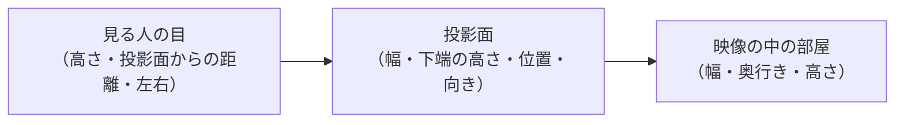

# room モード：仮想の部屋での日差しプレビュー

計算した太陽の位置・光の向きが、実際の空間の中でどう見えるかを確認するためのモード。
白いボックスの仮想の部屋（[sunabako](https://www.sunabako.jp/space/) のようなホワイトボックスの撮影スタジオが参考）に、日差しの計算結果をそのまま反映し、**パストレーシング**で光と影を描く。床・壁・天井での照り返しと、太陽の大きさによる影の縁のぼけを計算するので、実際の室内写真に近い見え方になる。窓は左・右・天井（天窓）に切り替えられる。水面の光の揺らぎ（床の水盤・窓の外の海・窓の外の水面の反射）も、それぞれオン・オフできる（6 章）。窓の外の空の雲（雲の影が部屋を通り過ぎる）と、スクリーンに visuals の映像を映す機能も切り替えられる（7 章）。展示（kiosk）には出ない、検証・確認用の画面。

- 開き方：開発サーバーでは `http://localhost:5173/?mode=room`、アプリでは `npm run app:room`
- 対象コード：`src/room/scene.ts`（光の計算と描画）、`src/room/daylight.ts`（大気を通った日差しの強さ）、`src/room/water.ts`（水の波）、`src/ui/room.ts`（パネル・状態表示）、`src/main.ts`（配線）、`src/solar.ts`（太陽の位置・窓から入るか）

---

## 1. 座標系の再利用

`src/solar.ts` の `lightOnScreen()` が返す `light.x, light.y, light.z` は、もともと画面（スクリーン）に対して「光が進む向き」を、鑑賞者から見た右・上・スクリーンの奥、の 3 軸で表したベクトルである（`docs/verification.md` 5 章）。

これは、部屋を「鑑賞者側が開いた箱」と見立てたときの部屋の向きと一致する。ただし screen 座標は**左手系**（右・上・奥）、three.js は**右手系**なので、そのまま載せると部屋全体が左右反転する（窓が逆側に見える）。そこで three.js 側では「スクリーンの奥 = −z」とし、z の符号だけ反転して使う（`toThree()`）：

| screen 座標 | three.js | 部屋での意味 |
|---|---|---|
| x（右、`rightAzimuth` 方向） | +x | 鑑賞者の右。`window.side = "right"` なら窓の壁 |
| y（上） | +y | 天井の方向 |
| z（スクリーンの奥、`facingAzimuth` 方向） | −z | 奥の壁（スクリーン側） |

実際に太陽がある向きは、光が進む向きの逆＝`-toThree(light)`。**窓の位置（`window.side`）や緯度経度が変わっても、この対応は変わらない**（`resolveSite()` が方位の変換を先に済ませているため）。room モード側のコードを変更する必要はなく、`config/site.json` を差し替えるだけでよい。

この対応は `tests/room.test.ts` で確認している（右手系で「右 × 上 = 手前」になること、右窓の正面の太陽が部屋の右＝窓の壁側に来ること）。

## 2. 部屋の構成

- 床・天井・壁 4 面（手前の壁も含む）で閉じた直方体。寸法は `config/site.json` の `room.widthM` / `depthM` / `heightM`。部屋は x = −W/2〜W/2、y = 0〜H、z = 0（鑑賞者側）〜 −D（スクリーン側）
- 部屋を 3D の面（ポリゴン）で作るのではなく、シェーダーの中で「直方体の内側から光線がどの面のどこに当たるか」を式で求める。形が単純なので、計算はほぼ一瞬で済む
- 窓は、窓のある面の中の長方形の範囲。光線がその範囲に当たったら「窓から外へ出た」とみなす
  - 壁の窓（`right` / `left`）：幅 `window.widthM` は奥行き方向、高さ `heightM`、床からの高さ `sillHeightM`。奥行きの中央に開く
  - 天窓（`ceiling`）：天井の中央に、幅 `window.widthM`（左右）× `heightM`（奥行き方向）で開く。`sillHeightM` は使わない
- 奥の壁の中央に、32:9 のスクリーン面の目印（反射率の低い灰色）を置く（投影面の実寸は未計測なので、奥の壁に収まる大きさ）
- 素材はすべて、光を全方向に均等に跳ね返す拡散反射（白い塗装の壁 0.82、床 0.72、スクリーン面 0.45。数値は反射率）
- カメラは鑑賞者の位置（部屋の幅の中央、目の高さ 1.5m、奥の壁から少し離れた位置）に置き、スクリーン（奥の壁）を正面に見る。画面の右 = 鑑賞者の右。`OrbitControls` で自由に視点を動かせる（ドラッグ：回転、ホイール：ズーム、右ドラッグ：平行移動）。カメラが部屋の外にあるときは、部屋に入った所から光線を追う（手前の面は描かれず、中が見える）

## 3. 窓の位置の切り替え

**開いたときの既定**（`src/ui/room.ts` の `ROOM_DEFAULTS`。保存した設定があれば、その値。10 章）：時刻は現在時刻、窓は天窓で天井いっぱい（天井の面が消える大きさ）、床の水盤はオン（水盤で跳ね返った光はオフ）、波の強さは 0.3、雲が日差しをさえぎるはオフ、計算の解像度は 75%、光の軌跡はオフ。URL で上書きできる（`?scale=1`・`?trails=1`・`?window=right`・`?winW=`・`?winH=`・`?pool=0`・`?poolReflect=1`・`?wave=1`・`?cloudShadow=1` など）。

パネルのいちばん上の「部屋 → 窓の位置」で、**左・右・天井**を切り替えられる（URL の `?window=right` などでも、最初に表示する窓を指定できる）。選ぶとその位置に窓ができ、そこから太陽光が入る。時刻の再生・早送りで、光の動きも確認できる。

- 切り替えは **room モードの表示と光の計算だけ**に効く。`config/site.json` は変わらないので、verify・visuals・展示の `lit` は設定どおりの窓（検証場所では右）で計算される。設定と違う窓を表示している間は、状態表示に「room モードだけの切り替え」と出る
- 切り替えると、部屋を作り直し、窓の向きで計算し直す。視点はそのまま引き継ぐ
- 窓の外向きの方位も、窓の位置に合わせて計算し直す（`withWindowSide()`：右 = スクリーン向き + 90°、左 = スクリーン向き − 90°、天窓 = 方位は使わない）
- 本番が天窓の場合は、`config/site.json` の `window.side` を `"ceiling"` にすれば、全モードが天窓として計算する

### 3.1 窓の大きさ

窓の位置の下のスライダーで、窓の大きさを変えられる。動かすとすぐに反映され、光の計算をやり直す（部屋は作り直さない）。URL の `?winW=1.5&winH=1.2&sill=0.9` などでも、最初の大きさを指定できる（m）。

| 項目 | 壁の窓（左・右） | 天窓 |
|---|---|---|
| 窓の幅 | 奥行き方向の幅（上限は部屋の奥行きの 95%） | 左右の幅（上限は部屋の幅。いっぱいにすると天井の面が消える） |
| 窓の高さ／奥行き | 窓の高さ | 奥行き方向の長さ（上限は部屋の奥行き） |
| 窓の下端の高さ | 床から窓の下端まで。下端 + 高さが天井を超えないように、片方を動かすともう片方を詰める | 使わない（隠れる） |

- 窓は、壁の窓なら奥行きの中央、天窓なら天井の中央に開く（位置は変えない）
- 「窓の大きさを設定どおりに戻す」で `config/site.json` の値に戻る。天窓のときは「天窓を天井いっぱいにする」ボタンも出る
- 天窓で始めたあと壁の窓に切り替えると、窓はその壁に収まる大きさに詰められる。天窓に戻したときに天井いっぱいにするには、ボタンを押す
- 天窓を天井いっぱいにすると、以前は壁に白い点がキラキラと出ていた。空の光の数え方を変えて直した（5.3 節「空の光の数え方」、14 章）
- `config/site.json` の検査は今までどおり、天窓が天井より小さいことを求める（天井いっぱいは room モードのパネルだけの試し）
- 窓の位置と同じく **room モードの表示と光の計算だけ**の変更で、設定ファイルは変わらない。設定と違う大きさの間は、状態表示に「room モードだけの変更」と出る。状態表示には、今の窓の寸法と面積も出る
- 窓の大きさは「光が入るか」「`lit`」には影響しない（どちらも太陽と窓の向きだけで決まる。4 章）。変わるのは、部屋に入る光の量（ほぼ窓の面積に比例）と、日だまりの大きさ・形
- 検証場所・本番で窓を実測したら、`config/site.json` の `window.widthM` / `heightM` / `sillHeightM` に書く（15 章）。パネルは、その前に大きさの違いを見比べるためのもの

## 4. 窓の位置と入射角

### 4.1 変わるもの・変わらないもの

窓の位置を変えても、**太陽の位置（方位・高度）と、そこから来る光の向き（`light.x/y/z`）は変わらない**。これらは日時と緯度経度だけで決まる（テストでも、窓を切り替えても `x, y, z` が同じであることを確認している）。

変わるのは、**窓の面に対して光が何度の角度で当たるか（入射角）**である。入射角は窓の面の垂線（窓の外向き）から測る。窓の外向きは、壁の窓なら水平、天窓なら真上なので、同じ太陽でも窓によって角度が変わる。

```
壁の窓：windowIncidence = cos h · cos(A − W)     （W = 窓の外向きの方位）
天窓  ：windowIncidence = sin h                  （外向きが真上）
入射角 = arccos(windowIncidence)
entersWindow = (h > 0) かつ (windowIncidence > 0)
lit の目標値 = min(1, windowIncidence × 3)       （約 0.5 秒かけて追従）
```

h = 太陽高度、A = 太陽の方位角。天窓は方位によらず、太陽が出ていれば光が入る。

### 4.2 計算例（検証場所：スクリーン向き 58.5°、右窓の外向き 148.5°）

| 日時 | 太陽 | 右の窓 | 天窓 |
|---|---|---|---|
| 冬至 10:00 | 方位 154.7°・高度 26.4° | cos = 0.890（入射角 約 27°）→ lit 1.00 | sin 26.4° = 0.445（入射角 約 64°）→ lit 1.00 |
| 夏至 12:00 | 方位 198.3°・高度 77.2° | cos = 0.143（入射角 約 82°）→ lit 0.43 | sin 77.2° = 0.975（入射角 約 13°）→ lit 1.00 |

夏の昼は太陽が高いので、壁の窓にはほぼ真横からかすめるように当たり（82°）、天窓にはほぼ真上から当たる（13°）。冬の朝は太陽が低いので、その関係が逆に近くなる。

### 4.3 入射角で決まること

1. **光が入るか**：太陽が窓の外側にあるか（`windowIncidence` が正か）
2. **入る光の量**：窓の正面から当たるほど、同じ窓の面積に多くの光が入る（斜めになるほど、光から見た窓の見かけの面積が小さくなる。ランベルトの余弦則と同じ考え方）
3. **床や壁に落ちる光の位置と形**：窓の開口の位置・向きと光の向きで決まる

verify・visuals・展示の映像では、1 と 2 をまとめた値として `lit`（`min(1, windowIncidence × 3)`）を使う。**room モードの光の計算では `lit` を使わない**：窓を通る光線を直接追うので、1〜3 がすべて形の計算からそのまま出てくる（`lit` は状態表示に参考として出している）。

実際のガラスは斜めに当たるほど反射が増えて通る光が減る（フレネル反射）が、この計算には入れていない（12 章）。

## 5. 光の計算（パストレーシング）

### 5.1 考え方

画面の画素ごとに、カメラから光線を飛ばし、当たった面から光がどう届いているかを逆にたどる。光は次の 3 つとして数える。

| 光 | 求め方 |
|---|---|
| 直射日光 | 当たった点から、太陽の円盤（見かけの直径 0.53°）の中の点へ向かって光線を飛ばし、窓を通って外へ出られれば日なた、壁にさえぎられれば日陰。円盤の中の 12 点で調べて平均するので、**影の縁のぼけは太陽の大きさと、窓から床までの距離で決まる**（例：5m 先で約 5cm） |
| 窓から見える空の光 | 窓の面の中の点を選んで、そこから入る空の光を足す（窓は面光源になる）。窓に近いほど、窓を大きく見込むので明るい。照り返しの光線がそのまま窓から外へ出たときの空の光も、もう 1 つの見本として混ぜる（5.3 節） |
| 照り返し | 当たった点から、跳ね返る向き（拡散反射なので、面の真上ほど多い）を選んで光線を次の面へ飛ばし、そこが受けている直射日光と空の光を、反射率を掛けて足す。これを「照り返しの回数」（既定 3 回）まで繰り返す |

窓から外へ出た光線は、空（上ほどその時間の空の上の色、地平線近くは下の色）か、地平線より下なら窓の外の地面（日差しと空の光を反射率 0.2 で返す）を見る。

### 5.2 日差しと空の明るさ

| 値 | 求め方 | 根拠 |
|---|---|---|
| 太陽の向き | `-toThree(light)`（1 章） | `src/solar.ts` の計算そのもの |
| 直射日光の強さ | 大気の外の値 × 大気を通った割合 `0.7^(AM^0.678)`。AM（空気量）は Kasten & Young (1989) の式。天頂で約 0.7、高度 10° で約 0.32、太陽が沈むと 0（`src/room/daylight.ts`） | Meinel (1976) の近似。太陽が低いほど大気を長く通って弱まる |
| 直射日光の色 | `lightColor`（太陽高度から決めた色温度の RGB） | 目安の色の表（`palette.ts`） |
| 空の明るさ | 昼は太陽が高いほど明るく、日没後は薄明（高度 −6° まで）で暗くなり、夜は最低限を残す | 演出上の近似 |
| 空の色 | `sky.top` / `sky.bottom`（太陽高度から決めた色） | 目安の色の表 |
| 直射日光と空の比 | 晴天時に「水平面が空から受ける光 ≒ 直射日光の 2 割」になる程度 | 晴天時の目安に合わせた演出上の値 |

**日差しと空の色の表をパネルで変える**：日差しの色温度と空の色は、太陽の高度だけで決まる目安の表（`src/palette.ts`）から求める（間の高度は前後の値を直線でつなぐ）。現地の光に合わせて追い込めるよう、パネルの「日差しと空の色（太陽の高度ごと）」で表の値を変えられる。変えた値は「部屋の設定を保存」で config/room.json に残る。

| 太陽の高度 | 日差しの色温度（既定） | 空の上（既定） | 地平線の近く（既定） |
|---|---|---|---|
| −8° 以下 | 2000K | #34386e | #5c4a7e |
| 0° | 2500K | #4f5896 | #c98a78 |
| 5° | 3500K | #7384bb | #e6ad80 |
| 20° | 5000K | #86a6d2 | #ecd6b6 |
| 30° 以上（空は 35° 以上） | 5800K | #93bbe0 | #dfe6ea |

- 高度の区切りは変えず、値だけを変える。「日差しと空の色を既定に戻す」で既定に戻る
- 変えると、照り返しの重ね合わせを直近 16 枚ぶんまでの重みに下げて、新しい色にすぐなじませる（太陽が動いたときと同じ）
- 効くのは room モードの表示と光の計算。検証・visuals・展示のモードは、コードの既定の表のまま

### 5.3 ざらつきを減らす工夫

パストレーシングは乱数で光線を選ぶので、1 回ではざらついた絵になる。次の工夫で、少ない計算で見やすくしている。

| 工夫 | 内容 |
|---|---|
| 空の光の数え方（2 通りの見本を混ぜる） | 窓の中の点を選ぶ方法は、小さい窓では効率がよい。しかし、窓のすぐ近くの点では「窓の面積 ÷ 距離²」が極端に大きくなる回があり、白い点（ファイアフライ）になる。天井いっぱいの天窓（60㎡）では、壁の上の縁や、そこで跳ね返る光でよく出ていた。そこで、照り返しの光線（面の向きに合わせて選ぶ）がそのまま窓から外へ出たときの空の光も見本にし、2 つを混ぜる（多重重点サンプリング、バランス・ヒューリスティック）。どちらの見本も「光 × cos ÷ 2 つの確率密度の和」で数えるので、1 回の値に上限ができ（光 × π）、平均の明るさは変わらない。照り返しの光線はもともと追っているので、足す光線は最後の点の 1 本だけ（3840×1080 で約 +2 ms） |
| フレームを重ねる | 毎フレーム 1 画素あたり 2 本（`?spp=4` などで変更可）の光線を追い、前のフレームまでの結果と平均する。止めていると本数が増え、ざらつきが減る（状態表示の「1 画素あたりの光線」） |
| 直射日光は乱数を使わない | 日だまりの縁が最もざらつきやすいので、直射日光だけは画面に出す段階で、太陽の円盤の決まった 12 点を毎フレーム確かめる。縁が常にくっきりする |
| 照り返しの成分をならす | 照り返しと空の光はなだらかに変わるので、同じ面の近くの画素どうしで平均する。面の境目（壁の角）と、スクリーン面の境目はまたがない。反射率を掛ける前の値でならすので、色の境目もぼけない。重ねた本数が増えるほど、ならす範囲を狭くする（パネルの「照り返しのざらつきをならす」で切り替え） |
| 視点・太陽が動いたとき | 視点を動かしたら最初から重ね直す。太陽が 0.06° 動いたら、古い結果の重みを直近 16 枚ぶんまで下げて追従させる（再生・早送り中も、照り返しは少し遅れて付いてくる） |

### 5.4 1 画素あたりの光線の本数

状態表示の「1 画素あたりの光線」は、その画素の明るさを決めるために、これまでに何本の光の経路を調べたか、の数である。

**なぜ本数が必要か**
画面のある 1 点の明るさは、「その点に、部屋中のあらゆる方向から届く光の合計」である。照り返しは床・壁・天井のあらゆる所から来るので、全部を正確に足すことはできない。そこで、光が来る向きを乱数で選んで 1 本ずつ光線を飛ばして明るさを調べ、その平均をその点の明るさとする（モンテカルロ法。アンケートの回答者を増やすほど平均が本当の値に近づくのと同じ考え方）。

- 本数が少ない：たまたま明るい日だまりに当たった光線が多いと明るく、少ないと暗くなる。画素ごとにばらつくので、画面がざらつく
- 本数が多い：ばらつきが平均されて、本当の明るさに近づく。ざらつきが消えて、なめらかな絵になる

**多いとどうなるか**
ざらつきの大きさは本数の平方根に反比例する（本数を 4 倍にすると、ざらつきが半分になる）。

| 本数（目安） | 見え方 |
|---|---|
| 数本〜数十本 | ざらざら。再生中はこのくらい（例：36 本） |
| 数百本 | ほぼなめらか。止めて数秒でここまで来る（例：5 秒で約 600 本） |
| 1000 本以上 | ほとんど変わらなくなる |

- 本数で変わるのは、ばらつきが残っているかどうかだけ。絵の平均的な明るさや、光と影の形は、本数が少なくても正しい
- 日だまりの縁（直射日光）は乱数を使わずに毎フレーム計算しているので、本数に関係なく最初からくっきりしている。本数で変わるのは、照り返しと空の光の部分

**本数の増え方**
- 止めている間は、毎フレーム 2 本ずつ増える（約 60fps なので、1 秒で約 120 本）
- 視点を動かすと 0 からやり直す（見え方が変わり、前の結果が使えなくなるため）
- 再生・早送り中は太陽が動くので、古い結果を早めに捨てる。そのため本数は数十本のあたりで止まる
- URL の `?spp=4` などで、1 フレームに追う本数を増やせる。早くきれいになるが、そのぶん重くなり FPS が下がる（5.7 節）

### 5.5 画面の仕上げ

露出（パネルの「露出（明るさ）」、既定 2.5）を掛け、ACES の近似式でトーンマッピングし（明るい所が白く飛ぶときになめらかに頭打ちにする）、sRGB に変換する。8bit の縞を抑えるため、わずかなディザを加える。実際の室内写真のように、部屋の中に露出を合わせると、窓や日だまりは白く飛び気味になる。

### 5.6 パネル

| 項目 | 内容 |
|---|---|
| 部屋 → 窓の位置 | 左・右・天井（3 章） |
| 部屋 → 窓の幅・高さ（奥行き）・下端の高さ | 窓の大きさ（3.1 節）。「窓の大きさを設定どおりに戻す」で設定の値に戻る |
| 日差しと空の色（太陽の高度ごと） | 日差しの色温度と空の色の表（5.2 節） |
| 光の計算 → 照り返しの回数 | 0〜6（既定 3）。0 にすると窓から直接届く光だけになり、照り返しの効果を見比べられる |
| 光の計算 → 照り返しのざらつきをならす | オン・オフ（既定オン） |
| 光の計算 → 露出（明るさ） | 0.1〜8（既定 2.5）。夕方や夜は暗くなるので上げて見る |
| 光の計算 → 重さを測る（60 フレーム） | 今の設定で 60 フレーム続けて描き、GPU の処理が終わるまで待って 1 フレームの時間を出す（その間は描画が止まる） |
| 水 | 床の水盤・窓の外の海・窓の外の水面の反射（それぞれオン・オフ）、波の強さ、水盤の深さ、窓の外の水面の高さ（6 章） |
| 空・雲 | 窓の外の空に雲・雲が日差しをさえぎる（それぞれオン・オフ）、雲の量・厚さ・大きさ・高さ・流れる速さ・風が吹いてくる方位（7.1 節） |
| スクリーン | スクリーンに映像を映す（オン・オフ）、映す映像、プロジェクターの明るさ（7.2 節） |
| 状態表示の 1 行目 | FPS と 1 フレームの時間（例：`FPS 60.0（1 フレーム 16.7 ms）`）。55fps を下回ると「※ 60fps に届いていない」と出る。画面の更新の上限（多くは 60）で頭打ちになるので、それより軽いかどうかは「重さを測る」で見る |
| 解像度 | 見え方（画面の枠・3840×1080 を縮めて見る・原寸で見る）、計算の解像度（倍）と 100%〜25% のボタン、引き伸ばし方、全画面で見る（5.8 節） |
| 部屋の設定を保存 | パネルの今の値を config/room.json に保存する（10 章） |
| 部屋 → 部屋の幅・奥行き・高さ | 部屋の寸法（9 章） |
| ライト（夜） | 鑑賞者の頭上のスポットライト（8 章） |
| 月明かり（夜） | 太陽が沈むと、月が窓から光を差し込み、夜空も明るくなる（8.4 節） |
| 視点・パース合わせ | 現地の空間と映像を合わせる（9 章） |
| 光の軌跡 | 部屋の中央の光の軌跡（7.4 節） |
| 時刻 | visuals モードと共通（現在時刻・再生・早送り・時刻や日付の指定） |

- パネルのスライダーは、マウスのホイールでは動かない（visuals のパネルも同じ）。長いパネルをスクロールしている途中で、ポインターがスライダーの上を通ると値が勝手に変わり、「時刻（分）」が動くと「現在時刻」もオフになっていたため。値はドラッグ・クリックか、数値の入力で変える

### 5.7 性能（Apple M4、描画範囲 約 1080×760 画素）

WebGPU で描く（使えない環境では自動で WebGL2）。計算は 2 つの方式で同じで、止めて重ねた絵は画素ごとの差が最大 1/255 だった。WebGPU の方が少し軽い（既定の設定で 6.4 ms と 6.8 ms、水・雲・スクリーンをすべてオンで 12.7 ms と 16.7 ms。[webgpu.md](webgpu.md) 3.2 節）。下の表は WebGL2 で測った FPS。

| 1 フレームの光線（1 画素あたり） | FPS | 5 秒で重なる本数 |
|---|---|---|
| 1 本 | 約 56 | 約 310 本 |
| 2 本（既定） | 約 52〜60 | 約 600〜700 本 |
| 4 本 | 約 39 | 約 930 本 |

- 高解像度ディスプレイでも、計算は 1 倍の画素数で行う（画素数がそのまま計算量になるため）
- 展示で 3840×1080 に同じ計算をするのは重い（[hardware.md](hardware.md) 5 章）。計算の解像度を下げて引き伸ばすスイッチで、見え方と重さを確かめられる（5.8 節）

### 5.8 計算の解像度（小さく計算して引き伸ばす）

パストレーシングは画素数がそのまま計算量になる。小さく計算して画面に引き伸ばせば軽くなる。展示の投影では細かいざらつき（グレイン）がきれいに出ないので、高い解像度が要らない可能性があり、それを確かめるためのスイッチ。

| パネル（解像度） | URL | 内容 |
|---|---|---|
| 見え方 | `?out=exhibit`・`?out=actual` | 下の 3 つ |
| 計算の解像度（倍） | `?scale=0.5` | 出す大きさに対する、計算する大きさの倍率（0.1〜1）。**既定は 0.75（75%）**：展示 PC の Mac mini（M5 Pro）で 3840×1080・60fps に収まる見込みの倍率（hardware.md 5.6 節）。0.5 なら縦横半分で、画素数は 1/4。100%・75%・50%・33%・25% のボタンもある |
| 引き伸ばし方 | `?upscale=pixel` | 「なめらか（線形補間）」（既定）か「画素のまま（ドット）」。ドットにすると、計算した 1 画素がどれくらいの大きさで映るかが分かる |
| 全画面で見る | | 部屋の画面だけを全画面にする（Esc で戻る）。「縮めて見る」のときは 32:9 のまま画面の幅に合わせる |
| フレームの速さ | `?fps=30` | 「画面の更新ごと（多くは 60fps）」（既定）か「30fps に固定」。30fps なら 1 フレームに 33.3 ms 使えるので、解像度 100% の 3840×1080 でも Mac mini（M5 Pro）で間に合う見込み（hardware.md 2 章）。状態表示の 1 行目に「上限 30fps」と出る。`?fps=30` は検証・visuals・展示のモードでも効く |

**見え方**

| 見え方 | 計算の基準 | 画面への出し方 |
|---|---|---|
| 画面の枠の大きさ（既定） | 枠の大きさ | パネルの横の枠いっぱい |
| 3840×1080 を縮めて見る（シミュレーション） | 3840×1080 | 32:9 の枠を、ページの幅いっぱいに縮めて出す（パネルはその下）。ノートパソコンや 1920×1280 の画面でも全体が見える。構図の確認と、展示の重さを測るのに使う |
| 3840×1080 を原寸で見る | 3840×1080 | 画面全体を覆い、**出す 1 画素 = 画面の 1 画素**で出す（高解像度ディスプレイでは CSS の大きさを 1/devicePixelRatio にする）。画面からはみ出す分は、スクロールバー・トラックパッドの横スクロール・Shift ＋ホイールで見る（この間はホイールでのズームを止める） |

原寸で見ている間は、パネルが隠れるので、画面の上に帯を出す。帯のボタンか、キーボードで切り替えられる。

| 操作 | ボタン | キー |
|---|---|---|
| 計算の解像度 | 100%・75%・50%・33%・25% | 1〜5 |
| 引き伸ばし方 | なめらか／画素のまま | P |
| 縮めて見るに戻る | 戻る（Esc） | Esc |

- アプリ（Electron）では URL を入力できないので、すべてパネルと帯で切り替える。ブラウザと同じに動くことを確かめた（13.6 節）
- 原寸で出す 1 画素の大きさは、展示のプロジェクターの 1 画素とは違う（投影では 1 画素が数 mm になる）。ざらつきの見え方の最終確認は、実際の投影で行う
- 実際のプロジェクター 2 台に 3840×1080 の枠なしウィンドウで出す「展示モードで room を出す」は、本番用のリポジトリでの作業（[system.md](system.md) 7.2 節）

- 状態表示に、計算している大きさ（例：`計算 1920×540（展示の 3840×1080 の 50%、画素数 25%）`）が出る
- 倍率を変えると、光線の重ね合わせはやり直しになる。窓の位置を切り替えて部屋を作り直しても、倍率・見え方はそのまま
- 光の揺らぎ（水面）の画像・スクリーンの映像の画像は、解像度によらず同じ大きさで計算する（面に貼る画像なので、画面の解像度とは別）。そのため、引き伸ばしても水面の網目の細かさは変わらず、画面の画素の粗さだけが変わる
- 照り返しのざらつきをならす範囲（5.3 節）は画素で決めているので、解像度を下げると部屋の中ではより広い範囲をならすことになる
- 見え方の確かめ方：パソコンの画面は投影より細かく見えるので、「縮めて見る」＋「全画面で見る」か「原寸で見る」で画面の幅いっぱいに出し、少し離れて見る。最終的には、実際のプロジェクターで投影して確かめる

**重さ（Apple M4、WebGPU、展示と同じ 3840×1080 を基準、「重さを測る」）**

| 計算の解像度 | 計算する大きさ | 効果なし | 水面の反射 ＋ 水盤 |
|---|---|---|---|
| 100% | 3840×1080 | 31 ms | 39.5 ms |
| 75% | 2880×810 | 18.5 ms | 22〜23 ms |
| 60% | 2304×648 | | 15〜16 ms |
| 50% | 1920×540 | 7.4 ms | 10.5 ms |
| 25% | 960×270 | 2.2 ms | 4 ms |

- 重さは、ほぼ画素数に比例して下がる（75% で約 56%、50% で約 25%）。水の光の揺らぎの計算（網目を描く分）は解像度によらないので、小さくするほど割合が大きくなる
- 同じ設定でも、ページを開いた直後などに 1〜2 割（ときに 2 倍近く）重く出ることがあった。何度か測って、そろった値を見る

### 5.9 参考にしたもの

Stefan Schmidt による Shadertoy の学習用パストレーサー（[3lB3DR](https://www.shadertoy.com/view/3lB3DR)、[WllGWn](https://www.shadertoy.com/view/WllGWn)）の見え方（照り返し・柔らかい影）を目標にした。これらのコードは **CC BY-NC-SA 3.0（非営利・継承）** なので、コードは写さず、一般的な手法（余弦に比例した向きの選び方、フレームの重ね合わせなど）から書いている。参考のシェーダーは面光源に偶然当たるのを待つ方式だが、太陽は小さすぎてその方式ではいつまでもざらつくので、ここでは太陽と窓へ直接光線を飛ばして確かめる方式（直接光のサンプリング）にしている。

## 6. 水面の光の揺らぎ（水のオプション）

プールの底や、水辺の建物の天井に見える、ゆらゆらした光の網目（コースティクス）を再現する。パネルの「水」で、次の 3 つを**それぞれ別に**オン・オフできる（URL でも `?pool=1`・`?sea=1`・`?ripples=1` で最初からオンにできる。組み合わせも自由）。

| 項目 | URL | 内容 |
|---|---|---|
| 床の水盤 | `?pool=0` で消す | 床全体を浅い水盤にする（既定でオン）。日だまりの中の水盤の底に光の網目が映る。水面には部屋や窓が映り込む |
| 床の水盤で跳ね返った光（壁・天井の揺らぎ） | `?poolReflect=1` | 水盤の水面で跳ね返った日差しが、壁・天井に揺らぐ光として映る（既定でオフ）。「窓の外の水面の反射」とは別のもの。以前は水盤をオンにすると必ず出ていて、窓の外の水面の反射がオフでも揺らぎが見えて紛らわしかったので、別に出し消しできるようにした |
| 窓の外の海 | `?sea=1` | 窓の外の景色を、地面から海（水平線まで続く水面）に変える。空の映り込みと、太陽の反射のきらめきが見える |
| 窓の外の水面の反射（天井・壁の揺らぎ） | `?ripples=1` | 窓の外の水面で跳ね返った日差しが、窓から入って天井・壁に揺らぐ光として映る |

- 「波の強さ」（0〜3、既定 1）：波の高さの倍率。0 にすると鏡のような水面になり、揺らぎは消える
- 「水盤の深さ」（0.02〜1.5m、既定 0.3m）：深いほど底の網目が大きく・ぼやけ、赤い光が吸収されて青緑になる
- 「窓の外の水面の高さ」（-5〜0m、既定 -1m、床から）：低いほど、反射した光が部屋の奥・天井の高い所まで届く
- 窓の外の海・水面の反射は、壁の窓（左・右）のときだけ効く。天窓では水面が見えないので、状態表示に注意を出す
- 「窓の外の海」をオフで「水面の反射」だけオンにすると、窓の外は地面に見えたまま、揺らぎだけが入る（見た目の組み合わせを自由にするため、あえて連動させていない）

### 6.1 波の形（`src/room/water.ts`）

向きと波長の違う正弦波を重ね合わせる。波が進む速さは、水の波の**分散関係** ω² = g·k + (σ/ρ)·k³（g：重力加速度、σ/ρ：表面張力÷密度、k：波数）から決める。長い波ほど速く進み、数 cm 以下のさざ波は表面張力で逆に速くなる（いちばん遅いのは波長 1.7cm 付近の約 23cm/s）。`tests/water.test.ts` で確認している。

| 波の組 | 本数 | 波長 | 使いみち |
|---|---|---|---|
| 水盤 | 16 | 5〜60cm | 向きを全方向にばらつかせる（規則的な模様にならないように） |
| 窓の外の水面 | 12 | 0.5〜6m | 風下の向きのまわり ±60° |
| 細かい波 | 8 | 5〜35cm | 窓から見える海のきらめきの見た目だけに使う |

波の動きは実際の時間（秒）で進む。早送り中でも波の速さは変わらない（600 倍速で波が動くと、何が起きているか分からなくなるため）。位相は倍精度の CPU 側で 2π ごとに巻き戻してから GPU に渡すので、何日動かし続けても波がカクつかない。

### 6.2 光の網目の計算（光の格子を投げる方法）

水面を細かい格子（水盤は 256 × 約 150、窓の外は 220 × 220）に分け、格子の点ごとに

1. その点の水面の傾きから、日差しの屈折（水盤の底へ）・反射（壁・天井へ）の向きを出す（屈折率 1.333）
2. その向きに進めて、当たる面（壁・天井・水盤の底）の上の位置を求める
3. 格子のマス目が、水面では何㎡で、当たった面では何㎡に広がった・縮んだかの比（面積の比）で明るさを決める。光が集まって狭くなった所が明るい網目になる

という計算を GPU で行い、面ごとの画像（512×512 画素）に足し込む。これは「集光（コースティクス）」を光の量の保存から直接求める方法で、光線をばらばらに飛ばすより少ない計算でくっきりした網目が出る。

- 屈折で入る割合・反射する割合は、フレネル反射（Schlick の近似）で決める。真上から当たると反射は約 2% で、ほとんどが水に入る。浅い角度ほど反射が増える
- 水盤の底では、深さぶんの水の吸収（赤 0.35/m、緑 0.06/m、青 0.015/m）を掛ける
- 水盤の反射は、窓から実際に日が当たっている所（日だまり）からだけ出す
- 窓の外の水面は、窓の四隅から太陽の反射の向きへ逆にたどって、窓に向かって光を返す範囲（に少し余裕を持たせた範囲）だけを計算する。その光が窓を通るかも確かめる
- 1 画素の明るさの上限を決めて（集光の一点で無限に明るくならないように）、少しぼかしてから使う
- 網目の画像は、パストレーシングの直射日光に加えて使う。照り返しの計算にも入るので、網目の光で周りの壁もわずかに明るくなる

### 6.3 見え方（水面・海）

- 水盤の水面：フレネル反射の割合で、部屋の映り込み（反射）と、水の中の底（屈折・吸収）を混ぜる。太陽が映る向きにはきらめきを足す
- 窓の外の海：空の色と太陽のきらめき（反射の向きが太陽に近いほど明るい、鋭いピーク）を、フレネル反射の割合で水の色と混ぜる。遠くの海ほど浅い角度になるので、空が映って明るく見える（実際の海と同じ）

### 6.4 性能

Apple M4、描画範囲 約 1080×760 画素で、3 つすべてオンでも約 60fps（揺らぎの計算は毎フレーム行う）。

## 7. 空の雲・スクリーンの映像・部屋の中央の光の軌跡

visuals の「光の雲」と同じ作り方の雲を、2 通りに使う。パネルでそれぞれ別にオン・オフできる。

| 項目 | URL | 内容 |
|---|---|---|
| 窓の外の空に雲 | `?clouds=1` | 窓から見える空に雲が流れる。「雲が日差しをさえぎる」がオンなら（既定はオフ。`?cloudShadow=1`）、雲が太陽を横切ると日だまりが暗くなり、雲の影が部屋を通り過ぎる |
| スクリーンに映像を映す | `?screen=1`（光の雲）、`?screen=映像の ID` | 奥の壁のスクリーンに、visuals の映像を投影したように映す。映した光は部屋の壁や床もほんのり照らし、水盤にも映り込む |

### 7.1 窓の外の空の雲

- **置き方**：地上から「雲の高さ」（既定 1500m）の水平な面に、雲の濃さの模様を置く。模様は、大きさを約半分ずつにした 3 次元ノイズの重ね合わせ（visuals の「光の雲」と同じ。`src/scenes/shader.ts` の `GLSL_SIMPLEX3`）。「雲の量」でしきい値を決め、それより濃い所を雲にする（0 で快晴、1 で全天の雲）
- **見え方**：窓から外へ出た視線が雲の面に届いた所の濃さで、空の色と雲の色を混ぜる。雲は日差しを受けて白く光り（太陽に近い向きほど明るい：前方散乱）、厚い所ほど暗く、空の光も受ける。地平線に近い雲は遠すぎるので、空気でかすんだように薄れさせる
- **雲の影**：部屋の中の点から太陽の向きへ進み、雲の面に届いた所の濃さ × 「雲の厚さ」の割合だけ、直射日光を弱める。直射日光（日だまり）・照り返しに入る日差し・水面の光の揺らぎ・海や水盤のきらめきのすべてに掛ける。影の縁は数十〜数百 m の幅でぼけるので、影の計算では細かい層を省いて 3 層だけ重ねる
- **流れ**：「風が吹いてくる方位」（既定 270° = 西風。日本の上空は偏西風で、雲はおおむね西から東へ流れる）の風下へ、「雲の流れる速さ」で流れる。方位は `config/site.json` のスクリーンの向きから部屋の向きに直す（`cloudFlowDir()`、`tests/room.test.ts` で確認）
- **速さの既定値**：実際の雲の高さ（1〜2km）での風は 5〜20m/s 程度だが、それだと部屋の中の変化がゆっくりすぎて確かめにくいので、既定は 30m/s にしている（1500m のかたまりが約 50 秒で通り過ぎる）
- **照り返しの追従**：雲の影は絶えず動くので、照り返しの計算は直近 32 枚ぶんまでの平均にとどめる（日だまりそのものは毎フレーム計算し直すので遅れない。遅れるのは、日だまりが周りを照らす照り返しだけで、約 0.5 秒）

### 7.2 スクリーンの映像

- visuals の映像を、展示と同じ 3840×1080 の画像に描き、スクリーン面に貼る。調整値は `config/visuals.json` に保存した値（visuals のパネルで「設定を保存」した値）。出力の明るさの範囲（`output.min` / `max`）も展示と同じに掛ける
- 映像の日差しの値（光の向き・`lit` など）は、room モードで選んでいる窓の位置で計算した値
- 映像の色（sRGB）を光の強さ（線形）に直し、「プロジェクターの明るさ」を掛けて、スクリーン面が出す光とする。部屋の光（日差し・照り返し）でスクリーンが照らされる分に足す
- 照り返しの計算で、跳ね返った光線がスクリーンに当たったら、その光を足す（ぼかした画像を読む）。映像の光が壁・床・天井を照らし、水盤の水面にも映る
- 遠くから見ると画像が縮小されるので、ミップマップを作ってちらつきを抑える

### 7.3 性能

Apple M4、描画範囲 約 1080×760 画素で、雲・スクリーン・水の 3 つをすべてオンにしても 60fps（画面の更新の上限）を保った。スクリーンの映像の分は、visuals での映像の重さ（光の雲で約 3.5ms）がそのまま加わる。

### 7.4 部屋の中央の光の軌跡

部屋の中央の空間を、たくさんの光の線が漂う演出。[three-line-trails](https://github.com/ray-zero3/three-line-trails)（ray-zero3）と同じ考え方の演出を、コードは写さずに書き直した（元のリポジトリにはライセンスの表記がない）。パネルの「光の軌跡」で出し消しと見え方を変えられる（既定では出さない。`?trails=1` で出して開く）。部屋を照らす光はまだ入れていない（線だけで見え方を確かめる段階）。

**動き**（`src/room/trails-sim.ts`）

- 線の先頭が、場所と時間で変わるなめらかなノイズ（3 次元の勾配ノイズ）の流れに乗って進み、中心からの距離に応じて中心へ引き戻される。残りの点は、1/60 秒ごとに 1 つずつ後ろへずれて軌跡になる（フレームの速さで軌跡の長さが変わらないよう、1/60 秒ずつ進める）
- 流れだけで動かすと、線が少数の流れに集まって 1 つの束になる。線ごとに少しずらした場所の流れを読ませて、ばらけさせる（「線ごとのばらつき」）
- 床と天井を越えないように高さを収める（床より下に行くと、水盤の水面の下に見えてしまうため）
- 毎フレーム計算するのは線の先頭だけ（既定 1,024 点）なので、GPU ではなく CPU で計算する。WebGPU・WebGL2 で同じ動きになる（system.md 7.4 節の当初の設計では GPU で計算する予定だった）

**描き方**（`src/room/trails.ts`）

- 部屋の画面の上に重ねた透明な画面に、WebGL2（three.js）で描き、CSS の `mix-blend-mode: plus-lighter` で明るさを足して重ねる（光の線なので、下の部屋の絵に光が加わる）
- 部屋の光の計算とは別の画面なので、計算の解像度を下げていても、線は出す大きさ（3840×1080 など）で細く描く
- カメラは部屋と同じもの（マウスの視点・パース合わせの視点）を使い、四隅の位置合わせも部屋の画面と一緒に掛かる
- 線は細い帯（点ごとに 2 頂点）にして、画面の上での太さを決める。先頭が太く明るく、後ろほど細く暗くなる。線ごとに明るさを少しばらつかせる

| パネル（光の軌跡） | 既定 | 内容 |
|---|---|---|
| 部屋の中央に光の軌跡を出す | オフ | `?trails=1` で出して開く |
| 線の本数 | 1,024 | 16〜4,096 |
| 軌跡の長さ（点の数） | 48 | 点の間隔は 1/60 秒ぶん進む距離。速さ 1.2 で約 0.7m |
| 太さ | 3 | 3840×1080 で出したときの画素。出す大きさに合わせて変わる |
| 明るさ | 1 | |
| 速さ | 1.2 | おおよその速さ（m/s） |
| 流れの細かさ | 0.6 | 大きいほど細かく曲がる |
| 線ごとのばらつき | 1.5 | 0 で全部の線が同じ流れに乗って束になる |
| 漂う範囲・中心の高さ・中心の位置 | 半径 1.2m・床から 1.6m・部屋の中央 | 中心の位置は部屋の手前の端から奥へ（m）。0 なら部屋の中央 |
| 色の決め方 | 日差し・ライトの色に合わせる | 「日差し・ライトの色に合わせる」：昼は日差しの色、太陽が沈むにつれて点いているスポットライトの色（平均）へ移る。「線ごとに色相をずらす（元の演出に近い）」：基準の色の色相から、線ごとに色相をずらす（ずらす幅は変えられる。1 で全部の色相）。「色を選ぶ」：選んだ 1 色 |

- 重さ（3840×1080、Apple M4、夜・天窓・水盤）：光の軌跡なし 27.1 ms、あり 29.8 ms（約 +2.7 ms。動きの計算・GPU への転送・描画の合計）
- 昼の明るい部屋では、明るさを足して重ねるので、白い壁の前では線が見えにくい（光の線なので、現実でも明るい所では見えにくい）

## 8. 夜のスポットライトと月明かり

太陽が沈んで窓から日差しが入らなくなると、代わりに**鑑賞者の頭上のスポットライト**が部屋を照らす。パネルの「ライト（夜）」で、点け方・台数と、ライトごとの明るさ・形・向き・位置・色を変えられる。

### 8.1 点け方と台数（全部のライトで共通）

| パネル | URL | 内容 |
|---|---|---|
| 点け方 | `?spot=auto` / `on` / `off` | 自動（太陽が沈むと点く、既定）・常に点ける・消す |
| 台数 | `?spotCount=2` | 1〜4 台（既定 3 台：中央・左 2.5m・右 2.5m）。ライト 1 から順に使う |
| 自動：点き始める太陽の高度 | | 既定 5°。太陽がこれより低くなると点き始める |
| ライトの器具を描く | | 既定はオフ。オンにすると、器具（小さな球）と、水盤の水面に映るそのきらめきを描く。オフでも照らす光は変わらない |
| 自動：最大になる太陽の高度 | | 既定 −4°。ここで最大の明るさになる。その間はなめらかに明るくなる（夕方は日差し・空の光と混ざる） |

### 8.2 ライトごとの設定

| パネル | 既定 | 内容 |
|---|---|---|
| 明るさ | 1 | 1 で、夜に露出 2.5 のとき照らされた床がほどよく見える程度 |
| 光の広がり | 60° | 光の円すいの全角 |
| 縁のぼけ | 0.35 | 0 でくっきり、1 で中心から縁まで徐々に暗くなる |
| 傾き | 35° | 真下を 0° として、スクリーン（奥）の方へ倒す角度 |
| 左右の向き | 0° | 右が正 |
| 位置：手前の端から・天井から・左右 | 0.6m・0.15m・0m | 鑑賞者の頭上（部屋の手前の端の、天井の近く）。2 台目は左 2.5m、3 台目は右 2.5m、4 台目は手前から 2m の位置が既定 |
| 色の決め方 | 色温度 | 「色温度で決める」（1800〜10000K、既定 9000K。時刻などには連動しない固定の値）か「色を選ぶ」（色を直接選ぶ） |

- 色を変えても、明るさ（輝度）は変わらないようにしている。青や赤の光は、それぞれの色の成分が強くなる
- 「このライトを既定に戻す」で、そのライトだけ既定の値に戻る

### 8.3 光の計算

| 光 | 求め方 |
|---|---|
| 直接照らす光 | ライトを点光源とし、円すいの外へは光を出さない（縁はぼかす）。部屋は中に物のない箱なので、部屋の中のどの点にも遮られずに届く。画面に出す段階で毎フレーム計算するので、照らされた範囲の縁はざらつかない |
| 照り返し | 床・壁で跳ね返った光が、周りをほんのり照らす（照り返しの計算にライトの光を足す） |
| 水盤の底 | 水面で屈折して底を照らす。屈折による向きの曲がりは省き、水に入る割合（約 97%）と、底までの水の吸収だけ掛ける |
| 器具そのもの・水面に映るライト | 「ライトの器具を描く」がオンのときだけ（既定はオフ）、器具を小さな球（半径 6cm）として描く。光る側（向いている側）は明るく、後ろ側は暗い灰色。水盤の水面に映る器具のきらめきも出る |

- 重さ（3840×1080、Apple M4、夜・天窓・水盤）：ライトなし 44 ms、1 台 43.5 ms（ほぼ増えない）、4 台 57 ms（約 +13 ms）。台数ぶん、照り返しの各点で計算が増える
- 天窓が天井いっぱいのときは、床で跳ね返った光の多くが空へ抜けるので、壁・天井は暗い（現実でも同じ）

### 8.4 月明かり

太陽が沈むと、太陽の代わりに「月」が窓から光を差し込み、夜空も明るくなる。夜に部屋が真っ暗にならないようにする。パネルの「月明かり（夜）」でオン・オフと見え方を変えられる（既定はオン。`?moon=0` で消して開く）。

| パネル | 既定 | 内容 |
|---|---|---|
| 月明かりを点ける | オン | 太陽が沈むと点く |
| 月の光の明るさ | 0.5 | 窓から差し込む月の光。先方の「夜に明るすぎる映像は避けたい」に合わせて控えめにしている |
| 夜空の明るさ | 0.7 | 窓から見える夜空と、そこから入る空の光（上ほど明るく、地平線の近くは少し暗い） |
| 色 | #a9bfff（青みの白） | 月の光と夜空の色。明るさは別に決めるので、色だけが効く |
| 月の方位・高度 | 南（180°）・50° | 実際の月の位置ではなく、ここで決める（実際の月は、出ていない夜や細い夜があり、いつも月夜にはならないため）。壁の窓のときは、月が窓の側にないと光は差し込まない |
| 点き始める・最大になる太陽の高度 | 0°・−8° | その間でなめらかに明るくなる（夕方は空の残りの光と混ざる） |

- **作り方**：太陽が沈んだあと（太陽の高度が 0° 以下）、太陽の向きと強さの代わりに、月の向きと強さを入れる。あとの計算は太陽と同じなので、日だまりと同じように月の光の形が床・壁に落ち、影の縁のぼけ（月の見かけの大きさは太陽とほぼ同じ 0.5°）、照り返し、水盤の光の揺らぎ、水面のきらめき、雲の影もそのまま効く
- 明るさは演出上の値。実際の月の光は日差しの約 40 万分の 1 で、そのままでは見えない。倍率 1 で、月の光は晴れた日の直射日光の約 1/10、夜空は昼の空の約 1/8
- スポットライト（8.1〜8.3 節）と一緒に点けられる。月の青い光とライトの暖かい光が混ざる
- 状態表示に「月明かり  点いている 100%」のように出る

---

## 9. パース合わせ（現地の空間と映像を合わせる）

現地で投影するとき、見る人の位置から見て、映像の中の部屋が実際の空間とつながって見えるように合わせる。パネルの「視点・パース合わせ」と「部屋」の寸法で行う。

### 9.1 考え方

映像が映る面（投影面）を「部屋を覗く窓」と考える。投影面の大きさ・位置と、見る人の目の位置を実寸で決めると、目から投影面を覗いた見え方が一つに決まる（軸外し投影。Kooima の一般化した透視投影）。画角とレンズシフト（見える範囲の上下左右のずれ）は、この 2 つから自動で決まるので、別に合わせる必要はない。



### 9.2 合わせる値

| パネル | 内容 |
|---|---|
| 視点 | 「マウスで自由に動かす」（既定）か「現地に合わせた視点（固定）」。固定のときはマウスで動かせない。`?view=fixed` で最初から固定 |
| 投影面：幅 | 映像の横幅の実寸（m）。高さは、幅と出す画面の縦横比（3840×1080 なら 32:9）から決まる |
| 投影面：下端の高さ | 床から映像の下の縁まで（m） |
| 投影面：位置 | 部屋の手前の端から奥へ（m）。0 なら、部屋の手前の端に投影面がある（部屋の開いた側を覗く）。負なら部屋の手前 |
| 投影面：左右のずれ | 部屋の中心からのずれ（m） |
| 投影面の向き | 左右・上下・回転（度）。投影面が部屋に対して斜めのとき |
| 目の位置 | 投影面からの距離（m）・床からの高さ（m）・投影面の中心から左右（m） |
| 部屋の寸法（「部屋」の欄） | 幅・奥行き・高さ（m）。動かし終えたときに部屋を作り直す。config/site.json の寸法は変えない（「部屋の設定を保存」で config/room.json に残せる） |
| 合わせるための線 | 部屋の辺（白）・床の格子（青、間隔は変えられる）・窓（緑）・スクリーン（黄）・ライトの位置と向き（橙）を、映像の上に重ねて出す。現地の柱や壁の角・床の目地に合わせる目印。`?guides=1` で最初から出す |
| 四隅の位置合わせ（台形補正） | 映像の四隅を、幅・高さの %（±25%）でずらす。プロジェクターの置き方による台形のゆがみを、最後に直す。画面に出すときの変形（CSS の射影変換）なので、計算の重さは変わらない。合わせるための線も一緒に変形する |

- 「投影面と目の位置を初期値に戻す」の初期値は、マウスで動かす前の視点とほぼ同じ見え方（投影面の幅 = 部屋の幅、目は手前 2.4m・高さ 1.5m）
- マウスで動かす視点に戻すと、固定にする前の視点に戻る

### 9.3 現地での手順（案）

1. 投影面（映像が映る範囲）の幅と、床から下端までの高さを測る
2. 見る人の立つ位置（代表の 1 点）で、目の高さと、投影面までの距離・左右のずれを測る
3. 「現地に合わせた視点（固定）」にして、1・2 の値を入れる
4. 見え方を「3840×1080 を原寸で見る」か、実際の投影にして、「合わせるための線」を出す
5. 部屋の寸法・投影面の位置を変えて、線を現地の柱・壁の角・床の目地に合わせる
6. 四隅の位置合わせで、投影のゆがみを直す
7. 「部屋の設定を保存」

---

## 10. 部屋の設定の保存（`config/room.json`）

パネルのいちばん上の「部屋の設定を保存（config/room.json）」で、パネルの今の値を保存する。次に room モードを開いたときに読む。

| 項目 | 内容 |
|---|---|
| 保存するもの | 窓の位置と大きさ、部屋の寸法、光の計算・水・空と雲・スクリーン（映す映像を含む）、ライト（夜）、解像度と見え方、パース合わせ、合わせるための線、四隅の位置合わせ |
| 読む順 | コードの既定 → 保存した値 → URL の指定（URL がいちばん強い） |
| 保存先 | 開発サーバーでは `config/room.json`（`/__save-room` 経由）。アプリでは、アプリ本体が `config/room.json` に書く（一時ファイルから置き換える。ログに `room-saved`） |
| 読み込みの確かめ | 寛容にする。既定と同じ種類の項目だけを使い、知らない項目・種類の違う項目は無視する（古い版で保存したファイルや、手で直して誤ったファイルでも、読める項目だけで動き続ける）。選択肢の値（窓の位置・点け方など）は、選択肢にない値なら既定にする。台数などは範囲に収める |
| ファイルがない・JSON として読めない | 既定の値で開く（アプリでは、読めなかったときログに `room-settings-error`） |

- パネルの「保存」の欄に、保存した設定を読み込んだか・保存した時刻が出る
- 本番用のリポジトリでは、現地の置き場（git の外。[system.md](system.md) 5 章）に置く

---

## 11. 以前の方式との違い

最初の版は、three.js の環境光（`HemisphereLight`）とスポットライト（太陽）、シャドウマップで描いていた。

| | 以前（シャドウマップ） | 今（パストレーシング） |
|---|---|---|
| 照り返し | なし。日陰は一様な環境光だけで、現実より暗く、日なたとの差が強い | 床・壁・天井で最大 6 回跳ね返る。日だまりの真上の天井が明るくなり、窓から遠い隅ほど暗くなる |
| 影の縁 | 見た目のぼかし（`PCFSoftShadowMap`） | 太陽の円盤の大きさから決まるぼけ |
| 空の光 | 部屋全体に一様 | 窓から見える空が面光源になる |
| 光の強さ | `lit` に比例 | 窓を通る光線を直接追う（`lit` は使わない） |
| 影の誤判定・継ぎ目の光漏れ | `shadow bias`・縁の重ねで対策が必要だった | 部屋の形を式で扱うので起きない |

## 12. 物理との対応

| 現象 | 対応 | 補足 |
|---|---|---|
| 太陽の向き・窓から入るか | ◯ | `src/solar.ts` の計算をそのまま使う（検証済み。docs/verification.md） |
| 窓の位置による入射角の違い・入る光の量 | ◯ | 窓を通る光線と、受ける面の向き（余弦）から、形の計算として出てくる |
| 照り返し（相互反射） | ◯ 仕組み / △ 値 | 拡散反射の光の往復を追う。反射率は白い塗装・床の目安の値で、実測ではない |
| 影の縁のぼけ | ◯ | 太陽の円盤（0.53°）の 12 点で調べる。12 点ぶんの段階はあるが、ぼけ幅そのものは物理どおり |
| スポットライトの光の届き方 | ◯ 仕組み / △ 値 | 点光源の距離の 2 乗の逆数と、受ける面の向き（余弦）。円すいの縁のぼかし方と明るさの目盛りは演出上の値。器具の大きさによる影の縁のぼけはない（部屋に物がないので影ができない） |
| 水盤の底を照らすスポットライト | △ | 水に入る割合と吸収は入れたが、屈折による向きの曲がり（水の中で光が集まる・広がる）は省いている。水盤で跳ね返ったライトの光が壁を照らす揺らぎもない |
| パース合わせの見え方 | ◯ | 目と投影面の実寸から、軸外し投影で見え方を決める（1 点から見たときに正しい。ほかの位置から見ると、ずれて見える） |
| 大気による直射日光の弱まり | ◯ 考え方 / △ 値 | 空気量と Meinel の近似。雲・もや・大気汚染は考慮しない |
| 空の明るさ・色 | △ | 目安の表と演出上の近似。実際の空の輝度分布（太陽のまわりが明るい、など）は計算していない |
| 明るさの目盛り（直射日光と空の比、露出） | △ | 晴天の目安に合わせた演出上の値 |
| 水の波の速さ（分散関係） | ◯ | 重力と表面張力による分散関係から計算。波の高さ・向き・本数は見た目で決めた仮の値（実際の風や水深は考えていない） |
| 水面での屈折・反射の割合 | ◯ | 屈折率 1.333、フレネル反射（Schlick の近似） |
| 光の網目（集光）の明るさ | ◯ 仕組み / △ 値 | 光の量の保存（面積の比）から出す。明るさの上限とぼかしを加えている |
| 水の吸収による色 | ◯ 考え方 / △ 値 | 純水の吸収の目安。濁り・水底の色は考えていない |
| 窓の外の水面の反射 | △ | 窓の四隅から逆算した範囲だけを計算し、その外の水面からの光は無視している。水面の手前の地面や護岸は考えていない |
| 雲の影で日差しが弱まる | ◯ 考え方 / △ 値 | 太陽の向きに雲の面まで進んだ所の濃さで弱める。雲を一枚の平らな面として扱い、厚み・雲の中での光の散乱は計算していない。厚い雲の下では実際は影の縁が消えるが、ここでは弱まるだけで縁は残る |
| 雲の見え方 | △ | 日差し・前方散乱・空の光の混ぜ方は見た目で決めた近似 |
| 雲があるときの空の光（窓から入る光） | 未実装 | 雲が増えると空からの光の量・色も変わるが、窓から入る空の光には雲を入れていない |
| 雲の流れ | ◯ 向き / △ 速さ | 風下へ流れる向きは方位から計算。速さの既定値は実際より速い（7.1 節） |
| スクリーンの映像の光 | ◯ 仕組み / △ 値 | 映した光が部屋を照らす・水面に映る、という仕組みは光線追跡で出てくる。プロジェクターの明るさは実測値ではない |
| ガラスの透過率の角度依存（フレネル反射） | 未実装 | 窓は素通しの穴として扱っている |
| 素材の光沢（鏡のような反射） | 未実装 | すべて拡散反射。つや消しの白い部屋を想定 |
| 人の目・カメラの明るさへの慣れ | 未実装 | 露出は手動。夕方や夜は暗くなるので、パネルで上げて見る |

## 13. 動作確認

### 13.1 窓の位置のスイッチ

ヘッドレスの Chrome で room モードを開き、パネルの「窓の位置」を人が操作するのと同じように切り替えて、状態表示と画面を確認した。

| 日時（太陽の位置） | 左の窓 | 右の窓 | 天窓 |
|---|---|---|---|
| 冬至 10:00（南南東・高度 26°、鑑賞者の右側） | 入らない（右の壁がさえぎる） | 入る。窓の形の光が床に落ちる | 入る。低い角度で入り、左の壁に当たる |
| 夏至 18:00（西北西・高度 10°、鑑賞者の左後ろ） | 入る。夕日の橙色の光（約 4000K）がスクリーンの壁に当たり、照り返しで部屋全体が暖かい色になる | 入らない | 入る。右の壁の上のほうに当たる |

- 夏至 12:00 の天窓では、光は天窓の真下から奥へ約 0.55m・左へ約 0.47m ずれた床に落ちる。天井高 3.2m と太陽の向きから計算したずれと一致した
- 切り替えで部屋を作り直してもエラーは出ない

### 13.2 パストレーシング（Apple M4 の GPU で実行）

| 確認したこと | 結果 |
|---|---|
| 照り返しの効果（冬至 10:00、右の窓） | 照り返し 0 回では日だまりと窓以外がほぼ真っ黒。3 回では日だまりの真上の天井が明るくなり、窓から遠い左の隅ほど暗い、なだらかな明暗になる |
| 天窓（夏至 12:00） | 天窓からの光で部屋全体が柔らかく明るく、日だまりの縁はくっきり |
| 窓から入らない時間（夏至 18:30、右の窓、高度 4.5°） | 空の光だけになり、部屋はかなり暗い（露出を上げると見える） |
| 再生（600 倍）中 | 1 画素あたりの光線が 36 本程度でも、ならす処理でざらつきは目立たない。止めると本数が増えてさらにきれいになる |
| FPS | 1 フレーム 2 本で約 52〜60fps |

### 13.3 水のオプション（Apple M4 の GPU で実行）

| 確認したこと（冬至 10:00、右の窓） | 結果 |
|---|---|
| 床の水盤のみ | 日だまりの中の水盤の底に光の網目、左の壁と天井の左奥に、水面で跳ね返った揺らぐ光。水面に壁が映り込む |
| 窓の外の海のみ | 窓の外が水平線まで続く海になる。部屋の中の光は変わらない |
| 窓の外の水面の反射のみ | 天井の窓側に、大きな揺らぐ光の網目が映る。窓の外は地面のまま |
| 3 つすべて | それぞれの効果が重なって出る。約 61fps、エラーなし |
| 天窓（夏至 12:00）で水盤と海をオン | 水盤は効き、海は効かない（状態表示に注意が出る） |

### 13.4 窓の大きさ（冬至 10:00、右の窓）

| 窓 | 結果 |
|---|---|
| 幅 1.5m × 高さ 1.2m、床から 1.2m（パネルのスライダーで変更、1.8㎡） | 日だまりが小さく床の奥に落ち、部屋全体が暗くなる（既定の 9.6㎡ の約 1/5 の光） |
| 幅 5.5m × 高さ 2.8m、床から 0.1m（`?winW=5.5&winH=2.8&sill=0.1`、15.4㎡） | 日だまりが床の広い範囲とスクリーンの壁まで届き、部屋全体が明るくなる |
| 天窓 1m × 1m（夏至 12:00） | 小さな日だまりが天窓の真下近くに落ちる |

いずれもエラーなし、約 61fps。動かすと 1 画素あたりの光線の本数が 0 からやり直しになることも確認した。

### 13.5 空の雲とスクリーンの映像（冬至 10:00、右の窓）

| 確認したこと | 結果 |
|---|---|
| 窓の外の空の雲（視点を窓の方へ向けて確認） | 青空に雲のかたまりが浮かぶ。地平線の近くは薄れる |
| 雲の影（2 秒おきに 30 秒撮影し、日だまりの明るさを測った） | 雲に隠れている間は日だまりが暗く、雲が切れると明るくなる（画面の明るさ 96 → 117 → 96） |
| スクリーンの映像（光の雲） | スクリーンに雲の映像が映り、その光で壁・天井がほんのり明るくなる |
| 雲・スクリーン・水盤・海・水面の反射をすべてオン | 水盤の水面にスクリーンの映像が映り込み、雲の影で日だまりが暗くなる。60fps、エラーなし |

- 最初は雲の濃さをそのまま不透明さに使っていたため、空一面が白っぽくなった。「雲の量」でしきい値を決めて、雲と青空の境目をはっきりさせた

### 13.6 計算の解像度（冬至 10:00、右の窓、水面の反射 ＋ 水盤）

| 確認したこと | 結果 |
|---|---|
| 「縮めて見る」で 100%・75%・50%・25% | 計算の大きさが 3840×1080・2880×810・1920×540・960×270 になり、枠は 32:9。絵の構図は同じで、25% では日だまりの縁や光の揺らぎの細部が少しぼける |
| 画面の枠の大きさで 50%、ドットで引き伸ばし | 枠の半分の大きさで計算し、`image-rendering: pixelated` で引き伸ばす |
| 窓の位置を切り替える（部屋を作り直す） | 倍率・見え方はそのまま |
| WebGL2（`?gpu=webgl`）でも同じ操作 | 同じ大きさで計算し、エラーなし |
| 見え方の 3 つ（ヘッドレスの Chrome、1512×900・高解像度） | 画面の枠：997×684 で計算。縮めて見る：3840×1080 で計算し 1465×412 に縮めて出す。原寸：CSS 1920×540（= 画面の 3840×1080 画素）で出し、横にスクロールできる。キー 3 で 50%、Esc で縮めて見るに戻る |
| アプリ（Electron、`npm run app:room`） | 既定で天窓・天井いっぱい・水盤オン・波 0.3・現在時刻。パネルの 50% のボタンと原寸の切り替え、帯の「戻る」が動く |

### 13.7 夜のスポットライト（天窓・水盤）

| 確かめたこと | 結果 |
|---|---|
| 夜（19:30、太陽の高度 −20° 前後）、1 台 | 頭上のライトが床（水盤）を照らし、奥の壁の下が少し明るくなる。器具は、光る側が白く、後ろ側が暗い灰色 |
| 夕方（17:25） | 空の光（薄紫）とライトの光が混ざる |
| 昼（12:00） | 状態表示が「消えている（太陽が出ている）」で、昼の見え方は前と同じ |
| 3 台・2 台目を「色を選ぶ」で青に | 左に青、中央と右に電球色の光。重なったところは混ざった色になる。パネルは台数ぶんのライトの欄だけ出る |
| WebGL2 と WebGPU | 差の平均 0.1、99% の画素で差 1/255 以内 |

### 13.8 パース合わせ（冬至 10:00、右の窓、「3840×1080 を縮めて見る」）

| 確かめたこと | 結果 |
|---|---|
| 現地に合わせた視点（初期値） | マウスで動かす視点とほぼ同じ見え方。合わせるための線（部屋の辺・床の格子・窓・スクリーン・ライト）が、部屋の絵の辺に重なる |
| 投影面の幅 6m・下端 0.8m、目は 3m 手前・高さ 1.6m・右に 1m | 目の位置に合わせて、部屋の見え方（奥の壁の位置・壁の見える量）が変わる。線も一緒に動く |
| 四隅：右上を横 −5%・縦 +4% | 映像と線が一緒に台形に変形する |
| 部屋の奥行きを 12m に | 部屋を作り直し、奥の壁が遠くなる |
| 計算（テスト） | 目が投影面の中心の正面なら、見える範囲は上下左右に対称で、画角は投影面の高さと距離から決まる。目が低いと見える範囲が上にずれる（`tests/room.test.ts`）。四隅の射影変換は、四隅がちょうど指定の位置に写る（`tests/warp.test.ts`） |

### 13.9 部屋の設定の保存

| 確かめたこと | 結果 |
|---|---|
| 窓を右・奥行き 9m・波 1.2・ライト 3 台・固定の視点・目の高さ 1.7m・解像度 50%・四隅を変えて保存し、読み直す | すべて保存した値で開く。「保存」の欄に「保存した設定を読み込んだ」 |
| 保存した後に `?window=ceiling&wave=0.5&view=free` で開く | URL で指定した項目だけ URL の値、ほかは保存した値 |
| JSON として読めないファイル | 既定の値で開く。エラーなし |
| 種類の違う項目（窓の位置 "nowhere"・奥行き "deep"・点け方 "blink"・台数 99）と、正しい項目（波 0.8）が混ざったファイル | 正しい項目だけ使い（波 0.8）、ほかは既定。台数は 4 に収める |
| アプリ（Electron）で保存 | config/room.json に書かれ、ログに `room-saved` |
| 読み込みの決まり（テスト） | 既定と同じ種類の項目だけを使う、選択肢にない値は既定にする（`tests/room-settings.test.ts`） |

### 13.10 部屋の中央の光の軌跡

| 確かめたこと | 結果 |
|---|---|
| 昼（12:00）・「日差し・ライトの色に合わせる」 | 部屋の中央に白い光の線が漂う |
| 夜（19:30）・スポットライト 3 台（電球色） | 線も電球色になる |
| 「線ごとに色相をずらす」 | 線ごとに違う色（元の演出に近い） |
| 計算の解像度 25%・WebGL2 | 部屋の絵は粗くなるが、線は細いまま。WebGPU と同じ動き |
| 最初の版 | 線が見えなかった：帯の三角形がすべて裏向きで、描かれていなかった（両面を描くようにした）。線が短く 1 つの束にまとまった：流れが弱く、全部の線が同じ流れに乗っていた（流れを強め、線ごとに流れを読む場所をずらした） |
| 動き（テスト） | ノイズはなめらかで、おおよそ −1〜1。2 分動かしても、線は漂う範囲の近くにとどまる。毎回、残りの点が 1 つ後ろへずれる（`tests/trails.test.ts`） |

### 13.11 月明かり（夜 19:30、天窓・水盤）

| 確かめたこと | 結果 |
|---|---|
| 月明かりなし（`?moon=0`）・ライトなし | 前と同じく、ほぼ真っ暗 |
| 月明かりだけ | 天窓から青白い月の光が差し込み、左の壁と床に月の光の形が落ちる。夜空も暗い青になる |
| 月明かり ＋ スポットライト | 月の青い光と、ライトの暖かい光が混ざる |
| 右の窓 | 月が窓の側にあるときだけ、窓の形の月の光が床に落ちる |
| 夕方（17:35） | 月明かりが点き始め、空の残りの光と混ざる |
| WebGL2 と WebGPU | 差の平均 0.17、99% の画素で差 2/255 以内 |
| 最初の明るさ（月の光 1・夜空 1） | 夜というより夕方の青い空のように明るかったので、既定を 0.5・0.7 に下げた |

## 14. これまでに直した問題

| 問題 | 原因 | 対応 |
|---|---|---|
| 天窓を天井いっぱい（10m × 6m）にすると、壁に白い点がキラキラと出た | 空の光を「窓の中の点を選ぶ」方法だけで数えていた。窓のすぐ近くでは「面積 ÷ 距離²」が極端に大きくなる回があり、太陽が少し動くたびに重ね合わせが短くなるので、点が消えきらずにまたたいて見えた。水盤の跳ね返りのせいではなかった（跳ね返りをオフにしても同じ位置に出た） | 照り返しの光線が窓から外へ出たときの空の光と混ぜる（5.3 節）。重ねきった明るさは前と同じ（画面の明るさの平均 80.4 と 80.4、171.79 と 171.8）、WebGL2 と WebGPU の差は最大 1/255 |
| 右にあるはずの窓が左に見えた | screen 座標（左手系）を three.js（右手系）にそのまま載せ、部屋全体が鏡像になっていた | z の符号を反転する `toThree()` を通す（1 章）。`tests/room.test.ts` で確認 |
| 窓以外の天井や壁を光が素通りしていた（正午に床全体が明るかった） | 以前の方式で、影を落とすのが窓のある壁だけだった | 外殻のすべての面が影を落とすようにした。今の方式では部屋の形を式で扱うので起きない |
| 天井と壁の境目に細い光の線が出た | 以前の方式で、面の継ぎ目と、影のずらし量（shadow bias）が大きすぎた | 縁を重ね、shadow bias を調整した。今の方式では起きない |
| 左に切り替えても「窓から入る」「lit」が右の窓のままだった | 窓の位置だけ差し替え、窓の外向きの方位が右の窓（148.5°）のまま残っていた | `withWindowSide()` で方位も計算し直す。テストで確認 |
| 壁の窓の幅を部屋の幅と比べて検証していた | 壁の窓は奥行き方向に並ぶので、比べる相手が違っていた | 部屋の奥行きと比べるように修正 |

## 15. `config/site.json` の項目

| 項目 | 内容 |
|---|---|
| `window.side` | `"right"` / `"left"` / `"ceiling"`（天窓） |
| `window.widthM` / `heightM` | 窓の実寸（m）。壁の窓は幅＝奥行き方向、天窓は幅＝左右・高さ＝奥行き方向 |
| `window.sillHeightM` | 床から窓の下端までの高さ（m）。天窓では使わない |
| `room.widthM` / `depthM` / `heightM` | 部屋の寸法（m）。実際の部屋の寸法ではなく、光の見え方を確認するための仮のボックス |

いずれも現地未計測の仮値。検証場所・本番の実測値が分かり次第、更新すること。窓の大きさは room モードのパネルで試しに変えられる（3.1 節）が、ほかのモードに効かせるにはこのファイルを書き換える。窓が部屋に収まらないと起動時にエラーになる（壁の窓：`widthM` < `room.depthM`、`sillHeightM + heightM` ≦ `room.heightM`。天窓：`widthM` < `room.widthM`、`heightM` < `room.depthM`）。

## 16. 分かっている課題

1. **ガラスの透過率の角度依存が未実装**：斜めに当たるほど通る光が減る効果（フレネル反射）を入れると、入る光の量がより現実に近づく
2. **空の輝度分布が簡略化されている**：実際の晴天の空は太陽のまわりと地平線近くが明るい（CIE 標準晴天空など）。入れると、窓の向きによる明るさの違いがより正確になる
3. **部屋の寸法・窓の実寸・素材の反射率が仮値**：現地測定後に `config/site.json` などを更新する
4. **周囲の建物による遮蔽は未考慮**（`docs/verification.md` と同じ課題）
5. **露出が手動**：夕方や夜は暗くなる。カメラの自動露出のように、部屋の明るさに合わせて露出を変える機能はまだない
6. **部屋の中に物がない**：家具・人・窓枠やサッシの影は入っていない
7. **水の波は仮の値**：波の高さ・向きは見た目で決めている。現地の水辺（川・海・池）の波の様子が分かれば、それに合わせて調整する
8. **水盤の網目がやや規則的に見えることがある**：正弦波 16 本の重ね合わせなので、長く見ていると繰り返しが分かる場合がある。本数を増やす・ノイズを足すと改善するが、そのぶん重くなる
9. **雲があっても、窓から入る空の光は変わらない**：曇ると空からの光が明るく白っぽくなる（晴天の青空より曇天の空のほうが明るいこともある）が、まだ入れていない
10. **プロジェクターの明るさが仮の値**：本番のプロジェクターの明るさ（ルーメン）とスクリーンの大きさ・反射率が分かれば、映像の明るさを実際の値に合わせられる
11. **パース合わせは 1 点から見たときに正しい**：見る人が動くと、ずれて見える（目の位置を追う仕組みはない）。代表の立ち位置を決めて合わせる
12. **四隅の位置合わせは映像全体で 1 つ**：プロジェクター 2 台（左右の 1920×1080）を別々に合わせる仕組みはまだない。2 台の継ぎ目の重ね合わせ（エッジブレンディング）もない。プロジェクター側の補正機能と分担を決める
13. **レンズのゆがみ・曲がった面は直せない**：四隅の位置合わせは平らな面の台形のゆがみだけ。広角レンズのたる型のゆがみや、曲がった壁への投影には、細かい格子での変形が要る
14. **スポットライトの影がない**：部屋に物がないので、ライトの影はできない。物を置く場合は、影の計算を足す必要がある
15. **ライトの台数ぶん重くなる**：4 台で 3840×1080 のとき約 +13 ms（Apple M4）。照り返しの各点で全部のライトを計算するため
16. **光の軌跡はまだ部屋を照らさない**：線の光が壁・床・水盤を照らす様子と、水盤の水面への映り込みは、まだ入れていない（線だけで見え方を確かめる段階。入れるなら、線全体を 1 つの光源とみなして光の計算に足す方法が軽い。system.md 7.4 節）
17. **光の軌跡は部屋の絵の上に重ねるだけ**：部屋の中に物を置いた場合、線が物の後ろに隠れない（今は部屋に物がなく、線は床と天井の間にとどまるので問題にならない）
