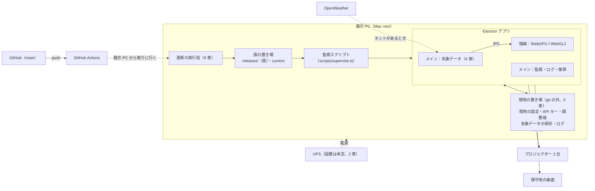
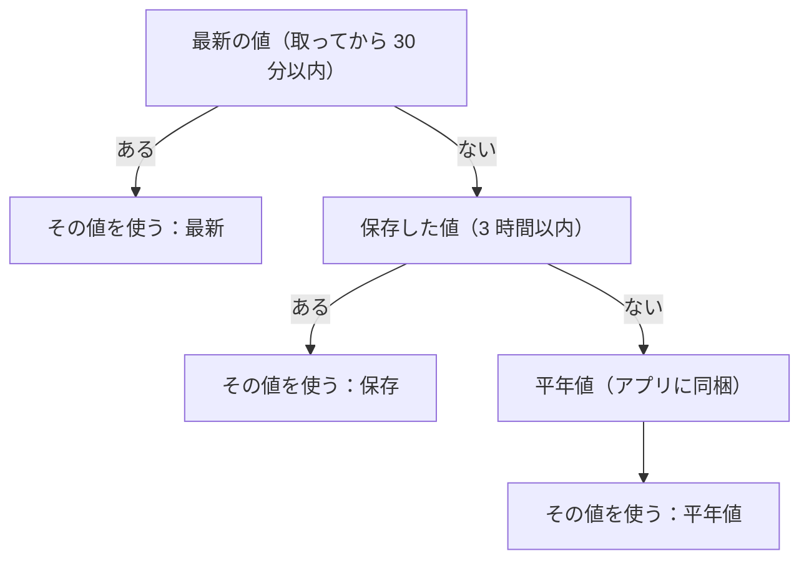
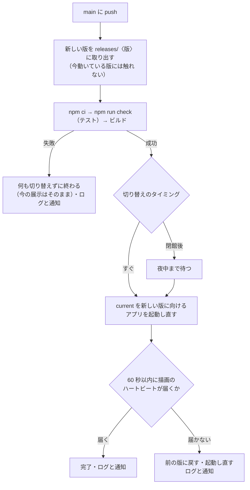

# システム構成

展示の PC の中で、何がどう動き、どう保守・更新するか。機材は [equipment.md](equipment.md)、PC の選定は [hardware.md](hardware.md)。

- この資料は**設計の段階**のもの。4 章（気象データ）・5 章（現地の設定）・6 章（更新）・7 章（room モードを展示に出す）はまだ実装していない
- **リポジトリの分け方**：このリポジトリ（`sunlight-test`）は検証用。展示で動かすものは、このリポジトリを元に**本番用のリポジトリを新しく作り**、別のリポジトリとして GitHub に置く（非公開）。4〜7 章は本番用のリポジトリで実装する。検証モード（平面図・グラフ）と room モードも本番用に持っていく
- **展示に出す映像**：今のところ、room モードが投影される可能性が高い（7 章）。PC の選び方への影響は hardware.md 5 章
- 前提：PC は第一希望の Mac mini（M5 Pro）。難しい場合は Windows のゲーミング PC（hardware.md 5.5 節）。Windows の場合の違いは各章に書く
- まだ分からないこと（プロジェクターまでの距離と機種、ネットワーク、置き場所）は 10 章

---

## 1. 全体像

| 部分 | 役割 | 状態 |
|---|---|---|
| Electron アプリ | 映像を描き、気象データを取り、異常から復帰する | 映像・復帰は実装済み。気象データは未実装 |
| 監視スクリプト | アプリが落ちたら起動し直す | 実装済み（`npm run app:forever`） |
| 現地の置き場 | 現地だけの設定・調整値・API キー・保存データ・ログ | 未実装（今は `config/` を直接書き換える） |
| 更新の実行役 | main への push で新しい版を取り込む | 未実装 |
| UPS | 停電への備え | 設置するか未定 |

---

## 2. 機材と電源

機材の一覧は equipment.md。ここでは電源と、PC の画面の並べ方をまとめる。

### 2.1 画面の並べ方

| 画面 | つなぎ方（Mac mini） | 役割 |
|---|---|---|
| プロジェクター 1（左） | HDMI | 映像の左半分（1920×1080） |
| プロジェクター 2（右） | USB-C（Thunderbolt）→ HDMI | 映像の右半分（1920×1080） |
| 保守用の画面 | USB-C 1 本 | 設定・ログの確認。展示中もつないだまま |

- 映像は 3840×1080 の 1 つのウィンドウで、プロジェクター 2 台にまたがって出す。macOS の「ディスプレイごとに個別の操作スペース」をオフにする
- 保守用の画面を主画面（左端）にした場合は、映像のウィンドウの位置（`window.x`）を保守用の画面の幅だけずらす。現地の設定（5 章）に書く
- Mac mini（M5 Pro）の外部の画面は 3 台まで。この 3 台でちょうど上限

### 2.2 UPS（無停電電源装置）—— 設置するかは未定

UPS は、中に電池が入った電源タップのような機器。コンセントと PC の間につなぎ、停電するとすぐに電池からの電気に切り替える。

| 停電の長さ | UPS あり | UPS なし |
|---|---|---|
| 一瞬（雷・工事などで数秒以内） | 止まらない | PC の電源が落ちる。電気が戻ると自動で起動する（2.3 節の設定をした場合）が、その間は映像が消える |
| 数分以上 | 電池が切れる前に PC が自分で終了する。電気が戻ると、毎日の起動の予定（2.3 節）で起動する | いきなり電源が落ちる。ファイルが壊れるおそれがある（アプリは書き込みを一時ファイルから置き換えて守っている） |

**決めるときの目安**：会場で瞬間的な停電（ブレーカーの操作・工事・雷）がどれくらい起きるか。施設の管理者に聞く。起きるなら付ける。

**付ける場合のおすすめ**

| PC | 機種 | 容量・出力 | 価格の目安 | 理由 |
|---|---|---|---|---|
| Mac mini | **APC BR550S-JP** | 550VA/330W、正弦波 | 約 19,000〜21,000 円 | USB でつなぐと macOS がそのまま UPS として認識する（USB HID）。ソフトなしで、電池が減ったら自動で終了する設定ができる |
| Windows | **APC BR1000S-JP**（または オムロン BW100T） | 1000VA/600W（610W）、正弦波 | 約 33,000〜36,000 円 | ゲーミング PC の電源（力率改善回路付き）には正弦波の出力が要る。消費電力の一時的な山にも余裕がある |

- オムロン BW55T（550VA/340W、正弦波、約 20,000 円）も人気だが、macOS はそのままでは UPS として認識しない（通信の方式が USB HID ではない）。自動で終了させるには、オムロンのソフト（PowerAct Pro）などが要る
- Mac mini（最大 155W）と保守用の画面（約 10W）なら、330W に十分な余裕がある。キャビネットの床に置く（数 kg）
- 電池は消耗品（3〜5 年で交換）

### 2.3 自動で起動する設定（UPS の有無によらず）

| 設定 | 内容 |
|---|---|
| 停電後に自動的に起動 | macOS の設定。電気が戻ったら PC が起動する |
| 毎日の起動の予定 | `pmset repeat wakeorpoweron` で毎朝決まった時刻に起動する。UPS の電池で PC が終了したあと電気が戻ると、PC は「電源が一度も切れていない」ので上の設定では起動しない。その保険 |
| 自動ログイン・ログイン時にアプリを起動 | 起動したら、そのまま展示が始まるようにする |
| スリープしない | アプリ側でも防いでいる（README「長期稼働のための仕組み」）が、OS の設定でも切っておく |

Windows では、BIOS の「AC 電源が戻ったら起動する」（Restore on AC Power Loss など）・自動ログイン・Windows Update の再起動の時間の設定が、これに当たる。

---

## 3. ソフトウェア

| 部分 | 使っているもの | 理由 |
|---|---|---|
| アプリ | Electron | PC の機能（ファイル・ウィンドウ・電源）を使える。Mac・Windows の両方で動く |
| 言語・組み立て | TypeScript、Vite | 型の検査、速い組み立て |
| 描画 | WebGPU（使えなければ自動で WebGL2）、three.js | [webgpu.md](webgpu.md) |
| 調整パネル | lil-gui | 今のまま |

**Vue・Nuxt について**

- **Nuxt は使わない**。Nuxt はサーバーで画面を作って配る仕組みが中心。参考にした渋谷サクラステージの構成（[rettuce.blog](https://rettuce.blog/2024/01/11/shibuyasakurastage/)）では、親機のサーバー（Nuxt 3）から複数の画面へ中身を配り、編集画面も別の端末から使うので、Nuxt が活きている。この作品は PC 1 台・アプリ 1 つなので、配る相手がいない
- **Vue は、保守用の画面が大きくなったら、その画面だけに使う**。たとえば気象データの状態・稼働の予定・ログの確認をまとめた画面。映像を毎フレーム描く部分には使わない（描画の速さに関係ない部分だけ）
- 将来、複数の画面を同期する、スマホから遠隔で設定を変える、といった構成になったら、アプリのメイン側に小さなサーバーを入れれば足りる（Nuxt までは要らない）

---

## 4. 気象データ（設計）

ネットが使えるときは気象データサービスから現在の天気を取り、映像に反映する。**ネットがない・切れた場合でも、エラーを出さず、映像を止めない。**

### 4.1 方針

1. **取りに行くのはメイン側（Node.js）だけ**。描画側はネットに一切触れない（今も描画側は外部と通信できない設定：`index.html` の Content-Security-Policy）。描画は気象データを待たないので、ネットの状態で映像が止まることはない
2. **使う値は 3 段階で必ず決まる**：最新の値 → 保存した値 → 平年値。どの段階でも同じ形の値になるので、映像の側は「いま何から来た値か」を気にしなくてよい
3. **値が変わるときはゆっくり**：数分かけて新しい値へ移る。取れた・取れないで映像が急に変わらない

### 4.2 どのサービスを使うか

展示は商用の利用にあたる。

| サービス | 無料枠 | 商用利用 | 注意 |
|---|---|---|---|
| **OpenWeather（Current Weather Data）** | 1 分 60 回・月 100 万回 | ◯ | 「Weather data provided by OpenWeather」のクレジット表示が必要。キーの登録だけで使える |
| OpenWeather（One Call API 3.0） | 1 日 1,000 回 | ◯ | 同上。支払い情報の登録が要るので、1 日の上限を 1,000 回に設定して課金されないようにする |
| Open-Meteo | 1 日 1 万回 | × 無料枠は非商用のみ | 展示に使うなら有料の契約 |
| 気象庁の公開データ | 無料 | 条件つきで可 | 大量のアクセスや再配布は利用規約の確認が要る |

**第一候補は OpenWeather の Current Weather Data**。10 分ごとに取って 1 日 144 回で、無料枠に遠く届かない。クレジット表示は、作品の説明パネルやキャプションに入れる。

### 4.3 取る値と、映像での使い道の例

Current Weather Data（`https://api.openweathermap.org/data/2.5/weather?lat=…&lon=…&units=metric&appid=…`）の答えから、次の値を取り出す。

| 値 | 答えの中の場所 | 映像での使い道の例 |
|---|---|---|
| 雲量（%） | `clouds.all` | 光の雲の量、room モードの雲、日差しの強さ |
| 湿度（%） | `main.humidity` | 結露の曇り |
| 気温（℃） | `main.temp` | 陽炎の強さ |
| 風速（m/s）・風向（度） | `wind.speed`・`wind.deg` | 水面の波、雲の流れる向きと速さ |
| 1 時間の雨量（mm） | `rain.1h`（降っていないときは無い） | 垂れる流れ など |
| 天気の種類 | `weather[0].id` | 雨・雪・霧などの見分け |
| 観測の時刻 | `dt` | 値の古さの判断 |

緯度・経度は `config/site.json` の場所の値をそのまま使う。どの映像のどのパラメータに結び付けるかは、映像ごとに決める（日差しの値と同じく、パネルでオン・オフを切り替えられるようにする）。

### 4.4 取り方

| 項目 | 決めごと |
|---|---|
| 間隔 | 10 分ごと（OpenWeather の現在の天気も、おおよそ 10 分ごとに更新される）。起動直後に 1 回 |
| 時間切れ | 1 回 10 秒。返事がなければ失敗として扱う |
| 失敗したとき | 取り直す間隔を 10 → 20 → 40 → 60 分と延ばす（ネットが長く切れているときに無駄に試さない）。成功したら 10 分に戻す |
| 1 日の上限 | 自分で上限（たとえば 1 日 500 回）を決めて数え、超えたら翌日まで取らない。数は現地の置き場に保存し、アプリを起動し直しても続きから数える |
| 答えの確認 | 数値が範囲内か（雲量 0〜100、湿度 0〜100 など）を確かめ、おかしい値は捨てる |
| 保存 | 成功したら、取った時刻と一緒に現地の置き場の `weather-cache.json` に書く（一時ファイルから置き換えて、書き込み途中で壊れないようにする） |
| ログ | 成功・失敗を記録する。失敗が続くときは、状態が変わったとき（成功 → 失敗、失敗 → 成功）だけ書いて、ログを埋めない |

### 4.5 使う値の決め方（ネットがない・切れたとき）

- **平年値**：気象庁の平年値（1991〜2020 年の平均。東京の観測所の月ごとの気温・湿度・雲量・風速・降水量）を JSON にして、アプリに同梱する。日付で前後の月の値をなめらかにつなぎ、気温は日の最高・最低の平年値から時刻による上下をつける。ネットが一度もつながらなくても、季節と時刻に合った値で動く
- 平年値は「平均的な日」なので、晴れの日も雨の日も同じ値になる。ネットがない会場では、気象データは「季節の変化」だけを映すことになる
- どの段階の値を使っているか（最新・保存・平年値）と、値の古さを、状態表示とログに出す

### 4.6 描画側への渡し方

- メイン側で値が決まったら（10 分ごと、または段階が変わったとき）、IPC で描画側へ送る
- 描画側は、映像が受け取る値（`SceneInput`）に `weather`（雲量・湿度・気温・風速・風向・雨量・どの段階か・古さ）を足す。日差しの値と同じく、どの映像からも使える
- 描画側で、届いた値へ数分かけて近づける（急に変わらないように）
- 開発サーバー（ブラウザ）では API キーを使わない。平年値か、URL で値を指定して試す（例：`?weather=cloud:80,humidity:90`）

### 4.7 API キーの置き場所

API キーは git に入れない。現地の置き場の `secrets.json` に書く（5 章）。メイン側だけが読み、描画側には渡さない。

---

## 5. 現地の設定を git の外に置く（設計）

### 5.1 なぜ要るか

今は、設定はすべて `config/`（git で管理している）にあり、visuals の「設定を保存」もそこを直接書き換える。このままだと：

- 現地で調整して保存した `config/visuals.json` と、main から取り込む更新がぶつかり、**git pull が失敗する**（または現地の調整が消える）
- PC ごとに違う値（映像のウィンドウの位置、実測した窓の大きさなど）を git に入れると、検証用の PC と展示の PC で取り合いになる
- API キーを git に入れるわけにいかない

### 5.2 2 つの置き場

| 置き場 | 場所 | 中身 | 誰が変えるか |
|---|---|---|---|
| **既定の設定**（git の中） | リポジトリの `config/` | 全員共通の初期値（場所の候補、映像の初期の調整値、アプリの既定） | 開発（commit して push） |
| **現地の置き場**（git の外） | Mac：`~/soracity/local/`、Windows：`%USERPROFILE%\soracity\local\`（環境変数 `SORACITY_LOCAL_DIR` で変えられる） | 現地だけの上書き・調整値・API キー・保存データ・ログ | 現地（パネルの保存、保守の人） |

現地の置き場の中身：

| ファイル | 中身 |
|---|---|
| `app.json` | アプリの設定のうち、この PC だけ違うもの（映像のウィンドウの位置など）。書いた項目だけ上書き |
| `site.json` | 場所の設定のうち、現地で決まったもの（使う場所、実測した窓の大きさ・向きなど）。書いた項目だけ上書き |
| `visuals.json` | visuals の「設定を保存」で書く現地の調整値（丸ごと） |
| `secrets.json` | API キーなど、人に見せないもの |
| `state/` | 気象データの保存（`weather-cache.json`）、1 日の取得回数など、アプリが書く状態 |
| `logs/` | ログ（今はリポジトリの `logs/`。版を入れ替えても残るように、ここへ移す） |

### 5.3 読み込み方

1. git の中の既定の設定を読む
2. 現地の置き場に同じ名前のファイルがあれば、**書いてある項目だけ**上書きする（入れ子の項目もたどって上書きし、配列は丸ごと置き換える）
3. 重ねた結果を、今と同じ検査（`src/config.ts` の検査）にかける

| 起きたこと | 動き |
|---|---|
| 現地の置き場がない | 既定の設定だけで動く（今と同じ） |
| 現地のファイルが壊れている・検査に通らない | **そのファイルだけ使わず**、既定の設定で動き続ける。保守用の画面とログに「現地の設定 ○○ を読めなかった」と出す（展示を止めない） |
| 既定の設定（git の中）が壊れている | 今と同じく、起動時にエラーを出して止める（開発の誤りなので、すぐ分かるように） |

- 状態表示とログに、どの現地のファイルを使ったかを出す
- visuals の「設定を保存」は、現地の置き場の `visuals.json` に書く。git の中の `config/visuals.json` は書き換えない

### 5.4 現地の調整を既定の設定に戻すとき

現地で決まった調整値を、ほかの PC の初期値にもしたいときは、現地の `visuals.json` を `config/visuals.json` に写して commit する（そのためのコマンドを用意する）。自動では戻さない（現地の試しの値が勝手に全員の初期値にならないように）。

---

## 6. システムの更新（設計）

main ブランチに push されたら、展示の PC が新しい版を取り込む。

### 6.1 webhook をそのまま使えない理由

webhook は、GitHub から展示の PC へ**外から接続して知らせる**仕組み。会場のネットワークは、ふつう外からの接続を通さない（ルーターの内側にある）ので、そのままでは届かない。参考の構成（渋谷サクラステージ）でも、ngrok（手元の PC を一時的に外へ公開するサービス）と踏み台サーバーを使っている。

### 6.2 方式

| 方式 | 仕組み | 評価 |
|---|---|---|
| **GitHub Actions のセルフホストランナー** | 展示の PC に GitHub の「実行役」を常駐させる。PC から GitHub へ接続して待ち、main への push を受け取って、決めた手順を PC の上で動かす | **おすすめ**。外からの接続が要らず、ngrok も要らない。更新の結果とログが GitHub の画面で見られる |
| webhook ＋ ngrok（または Cloudflare Tunnel） | 参考の構成と同じ。PC を外へ公開し、webhook を受けて git pull する | 動くが、公開の仕組みの保守と、なりすましへの対策（webhook の署名の確認）が要る |
| 定期的に確認 | 5〜10 分ごとに PC から main を見に行き（git fetch）、新しければ取り込む | 一番簡単で確実。反映が数分遅れるだけ。ランナーが止まったときの予備にもなる |

### 6.3 更新の流れ

- **版の置き場**：`~/soracity/releases/〈版〉/` に版ごとに取り出し、`~/soracity/current` を今使う版に向ける（シンボリックリンク）。監視スクリプトとアプリは `current` から起動する。直近の数版を残しておき、戻せるようにする
- **現地の置き場（5 章）は版の外**にあるので、更新しても現地の設定・調整値・API キー・ログは残る
- **切り替えのタイミング**：アプリを起動し直す数秒間、映像が消える。開館中を避けたいなら「閉館後」にする（設定で選べるようにする）
- **確かめ方**：今もある描画のハートビート（10 秒ごと）が、新しい版で 60 秒以内に届くかで判断する
- **通知**：結果を GitHub の画面とログに残す。必要なら Slack などにも送る

### 6.4 気をつけること

- **リポジトリは非公開にする**：セルフホストランナーを公開リポジトリで使うと、他人の変更の提案（プルリクエスト）で展示の PC の上のコードが動かされるおそれがある（GitHub も公開リポジトリでの利用を勧めていない）。更新は「main への push」のときだけ動くように制限する
- **ネットがないとき**：自動では更新されない。USB メモリで新しい版を持ち込み、同じ手順（取り出し → テスト → 切り替え → 確かめ）で入れる方法を用意する
- **`npm ci` にはネットが要る**：部品（node_modules）の取得にネットを使う。ネットが不安定な会場では、ビルド済みの版を GitHub から取ってくる形（GitHub Actions で組み立てて置いておく）も考える

---

## 7. room モードを展示に出す（設計）

今の room モードは、検証用の画面の中で確かめるためのもの（マウスで視点を動かし、パネルで設定する）。展示に出すには、次の作業が要る。

### 7.1 使う予定の効果

| 効果 | 使う見込み |
|---|---|
| 窓の外の水面の反射（天井・壁の揺らぎ） | 90% |
| 部屋の中央の光の軌跡（7.4 節） | 90% |
| 床の水盤 | 50% |
| 雲（負担の少ない方法で、7.3 節） | 50% |
| スクリーンの映像 | 20% |
| 窓の外の海 | 5% |

### 7.2 展示に出すための作業

| 作業 | 内容 |
|---|---|
| 展示モードで room を出す | 3840×1080 の枠なしウィンドウに、パネルなしで全画面に出す。今の展示モードは visuals の映像だけを出す |
| 視点を固定する | 現地の空間に合わせた視点（投影面と目の位置からの軸外し投影、四隅の位置合わせ）。**検証用のリポジトリに実装した**（room.md 9 章）。本番では、保存した値で展示モードを開く |
| 設定を保存する | パネルの値を config/room.json に保存し、次に開いたときに読む。**検証用のリポジトリに実装した**（room.md 10 章）。本番では、現地の置き場（5 章）に置き、展示モードで読み込む |
| 計算の解像度を選べるようにする | PC の性能に合わせて、パストレーシングを 0.75 倍などで計算して拡大する（hardware.md 5.4 節）。光の軌跡は元の解像度で描く。確かめるためのスイッチは検証用のリポジトリに用意した（room.md 5.8 節）。本番では、決めた倍率を設定ファイルに書く |
| 長時間の稼働を確かめる | 何日も動かして、照り返しの重ね合わせ・雲の巻き戻し・波の位相がずっと正しく動くか、メモリが増え続けないかを確かめる |
| 重さを測る | 本番の PC で、パネルの「重さを測る（60 フレーム）」で確かめる |

### 7.3 雲を軽くする方法

今の雲は、画素ごと・照り返しのたびに雲の影を計算していて、3840×1080 で 9.5 ms ほど重くなる（hardware.md 5.2 節）。

- 雲のかたまり（数百 m〜数 km）は部屋（10m）よりずっと大きく、影の縁も数十 m 以上の幅でぼけるので、部屋の中では雲の影の濃さはどこでもほぼ同じと見てよい
- そこで、雲の影の濃さを部屋の中心で 1 フレームに 1 回だけ求め、すべての画素で同じ値を使う
- 窓から見える空の雲は、窓の画素だけで計算する（重ねる層も減らせる）
- これで 1 ms 程度になる見込み。物理の見方としてもほぼ正しい（部屋の中を雲の影の縁が横切る様子は出なくなるが、実際にも縁は部屋より広くぼけている）

### 7.4 部屋の中央の光の軌跡

[three-line-trails](https://github.com/ray-zero3/three-line-trails) のような、たくさんの光の線が流れに乗って漂う演出を、部屋の中央に置く。

**元の演出の仕組み**（コードを読んで確かめた）

- 線 1,024 本 × 1 本あたり 32 点。点の位置と速さを、GPU で画像として計算する（GPGPU）
- 速さは、場所と時間で変わるノイズ（4 次元のシンプレックスノイズ）で決め、中心へ引き戻す力を足す。そのため線は中心のまわりを漂い続ける
- 毎フレーム、線の先頭を進め、残りの点を 1 つずつ後ろへずらす。これが軌跡になる
- 描くのは 1 画素の太さの線。色は線ごとに色相をずらす

**この作品での作り方**

| 項目 | 方針 |
|---|---|
| ライセンス | 元のリポジトリには**ライセンスの表記がない**。表記がない場合はコードを写して使えないので、手法（一般的な GPGPU の軌跡。参考にしている Qiita の解説と同じ考え方）を元に書き直す。ノイズの関数は webgl-noise（MIT ライセンス）を使う |
| 計算 | WebGPU ではコンピュートシェーダー（GPU の汎用の計算）、WebGL2 では画像に描く方法で、点の位置と速さを計算する。3 万点ほどなので、ごく軽い |
| 太さ | 1 画素の線は、外光のあるロビーで投影すると見えにくい。線を細い帯（2 枚の三角形）にして、太さを決められるようにする（visuals.md 9 章の「細かい表現は潰れて見えにくい」と同じ理由） |
| 部屋との重ね方 | パストレーシングで描いた部屋の上に、線を重ねて描く。線は部屋の中央の空中にあるので、壁や床に隠れることはほとんどない。水盤の水面より下にある部分だけ隠す |
| 部屋を照らすか | 線の光が壁や床を照らす様子は、線全体を 1 つの光源（平均の色と明るさ）とみなして、パストレーシングに足す方法が軽い。水盤への映り込みは、まず入れずに見え方を確かめる |
| 日差しとの関係 | 線の色や流れの速さを、太陽の高さ・光の色・気象データ（風）と結び付けられる。どれに結び付けるかは作りながら決める |
| 重さ | 計算・描画とも 1 ms 程度の見込み（hardware.md 5.4 節） |

## 8. 時計・稼働の予定・プロジェクター

| 項目 | 内容 |
|---|---|
| 時計 | ネットがあれば OS の時刻合わせ（NTP）を使う。ない場合は定期的に確かめる運用（verification.md 9.1 節） |
| 稼働の予定 | 毎朝の起動（2.3 節）、毎日の再読み込み（今もある、`dailyReloadAt`）、更新の切り替え（閉館後の場合） |
| プロジェクターの電源 | プロジェクターが LAN につながれば、PC から PJLink（プロジェクターを操作する共通の方式）で、開館・閉館に合わせて電源を入り切りできる。インターネットがなくても、PC とプロジェクターの間の LAN だけで動く。機種が決まったら確かめる |

---

## 9. 実装の順番（案）

1. 現地の置き場と設定の重ね方（5 章）。ほかの 2 つの前提になる
2. 気象データ（4 章）：平年値 → 取得と保存 → 描画への受け渡し → 映像への反映
3. 更新の仕組み（6 章）：版の置き場と切り替え・戻し → 定期的な確認 → セルフホストランナー
4. room モードを展示に出す（7 章）：展示モードでの表示・視点の固定・設定の保存 → 軽い雲 → 光の軌跡 → 計算の解像度 → 長時間の稼働の確認

1〜3 は本番用のリポジトリを作ってから進める。4 は、見え方を確かめる部分（光の軌跡・軽い雲）を先にこの検証用のリポジトリで試してもよい。

---

## 10. 決まっていないこと

| 項目 | 決まると分かること |
|---|---|
| プロジェクターまでの距離と機種 | HDMI ケーブルの長さと種類、PJLink を使えるか |
| 会場のネットワーク（有線 LAN・Wi-Fi・なし） | 気象データ・自動更新・時刻合わせ・遠隔保守ができるか |
| キャビネットの置き場所 | 保守のしやすさ、熱 |
| UPS を付けるか | 会場で瞬間的な停電がどれくらい起きるか（施設の管理者に確認） |
| 更新の切り替えのタイミング | すぐか、閉館後か |
| リポジトリを非公開にできるか | セルフホストランナーを使えるか |
| 気象データを映像のどこに結び付けるか | 4.3 節の使い道の例を元に決める |
| 更新の結果を通知するか | Slack などを使うか |
| PC（第一希望は Mac mini、難しければ Windows のゲーミング PC） | 解像度を下げた見え方と、効果の組み合わせの重さで決める（hardware.md 5.5 節） |
| 本番用のリポジトリの名前・作るタイミング・履歴を引き継ぐか | 本番用のリポジトリの準備 |

---

## 11. 出典

- [three-line-trails](https://github.com/ray-zero3/three-line-trails)（光の軌跡の演出の参考。ライセンスの表記なし）
- [渋谷サクラステージのシステム構成（rettuce.blog）](https://rettuce.blog/2024/01/11/shibuyasakurastage/)（Nuxt 3 のサーバーと Electron、webhook からの git pull、ngrok）
- UPS：[価格.com の売れ筋](https://kakaku.com/pc/ups/ranking_0140/)（価格）、[APC BR550S-JP の評価](https://note.com/sone_ltd/n/n86e5f0aff5d9)（USB HID で OS がそのまま認識）、[APC BR550S-JP と オムロン BW55T の比較](https://mitani.work/feature/compare-ups-for-telework/)、[オムロン BW55T と NUT](https://zenn.dev/jlandowner/scraps/2903478a7ffa57)（通信の方式）、[オムロン PowerAct Pro](https://socialsolution.omron.com/jp/ja/products_service/ups/product/soft/poweractpro.html)、[APC BR1000S-JP](https://www.se.com/jp/ja/product/BR1000S-JP/)
- 気象データ：[OpenWeather One Call API 3.0](https://old.openweathermap.org/api/one-call-3)、[OpenWeather の無料枠（2026）](https://apiscout.dev/guides/openweathermap-free-tier-limits-2026)、[Open-Meteo の料金](https://open-meteo.com/en/pricing)、[気象庁ホームページについて（利用規約）](https://www.jma.go.jp/jma/kishou/info/coment.html)
