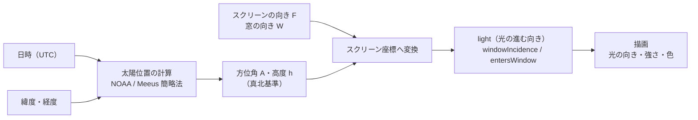

# 太陽光連携 検証ドキュメント

第一段階の検証で「何を計算し、どう確かめているか」をまとめたもの。
案件の前提・コンセプトは [sola_city_projection_overview.md](../sola_city_projection_overview.md)、使い方は [README](../README.md) を参照。

- 対象コード：[`src/solar.ts`](../src/solar.ts)（TypeScript）／ [`src/solar.py`](../src/solar.py)（Python・TouchDesigner 用。同じ式）
- 数値例はすべて検証場所の設定（下記）で、実際にコードを実行して得た値

---

## 1. 検証の目的と範囲

実際に窓から差し込む日差しと、映像内の「仮想の光」を同期させるための土台として、次の 3 点が正しいかを確かめる。

1. **太陽の位置**（方位角・高度）が、日時と緯度経度から正しく求まるか
2. それを**スクリーンから見た光の向き**に正しく変換できるか
3. **窓から光が入るかどうか**を正しく判定できるか

あわせて、展示を想定した**長時間の連続稼働**（数日）に耐えるかも検証する。

範囲外（次の段階以降）：周囲の建物による遮蔽、照度センサー、気象庁データ、映像表現の作り込み。

---

## 2. 全体の流れ



時刻は 1 フレームごとに現在時刻（または検証画面で指定した時刻）から計算し直す。状態を持たないので、再起動してもすぐ正しい表示に戻る。

---

## 3. 入力値

`config/site.json` の値。検証場所の場合：

| 項目 | 値 | 説明 |
|---|---|---|
| 緯度 φ | 35.692948823007555 | 北緯 |
| 経度 λ | 139.7832292459908 | 東経 |
| UTC オフセット | 540 分（JST） | PC のタイムゾーン設定には依存させない |
| スクリーンの向き | 66°（コンパス値） | 鑑賞者がスクリーンを見る向き |
| 磁気偏角 | −7.5°（西偏） | 東京付近の目安。国土地理院の値で要確認 |
| 窓の位置 | 右 | 鑑賞者から見て右側 |

### 3.1 磁北から真北への変換

計算で求まる太陽の方位角は**真北**基準、スマホのコンパスは**磁北**基準なので、スクリーンの向きを真北基準に直す。

```
F（真北基準） = コンパス値 + 磁気偏角 = 66 + (−7.5) = 58.5°
```

東京では磁北が真北より約 7.5° 西にずれているため、コンパスの値をそのまま使うと、光の向きが 7.5° ずれる。

### 3.2 部屋の向き

| 記号 | 意味 | 求め方 | 検証場所 |
|---|---|---|---|
| F | スクリーンを見る向き | 3.1 の通り | 58.5°（東北東） |
| R | スクリーンの「右」の向き | F + 90° | 148.5°（南南東） |
| W | 窓の外向き | 右窓なら F + 90°、左窓なら F − 90° | 148.5°（南南東） |

窓が部屋に対して斜めの場合は、`window.facingAzimuth` で W を直接指定できる。

---

## 4. 太陽位置の計算

NOAA（アメリカ海洋大気庁）の Solar Calculator と同じ、Meeus『Astronomical Algorithms』の簡略法。入力は日時と緯度経度だけだが、地球の**自転**（1 日の動き）と**公転**（1 年の動き）、軌道の楕円と地軸の傾きによる補正を式の中で計算している。

### 4.1 手順

角度はすべて度。

| # | 量 | 式 | 意味 |
|---|---|---|---|
| 1 | ユリウス日 JD | UNIX 時刻(ms) / 86400000 + 2440587.5 | 通し番号の日数 |
| 2 | ユリウス世紀 T | (JD − 2451545.0) / 36525 | 2000 年 1 月 1 日 12 時（UTC）からの経過（100 年単位） |
| 3 | 平均黄経 L0 | 280.46646 + T(36000.76983 + 0.0003032T) | 太陽の平均的な位置 |
| 4 | 平均近点角 M | 357.52911 + T(35999.05029 − 0.0001537T) | 軌道上の位置（楕円補正用） |
| 5 | 離心率 e | 0.016708634 − T(0.000042037 + 0.0000001267T) | 地球軌道の楕円の度合い |
| 6 | 中心差 C | sin M(1.914602 − …) + sin 2M(0.019993 − …) + 0.000289 sin 3M | 楕円軌道による速さのむら |
| 7 | 視黄経 λ☉ | L0 + C − 0.00569 − 0.00478 sin Ω | 見かけの太陽の位置（Ω = 125.04 − 1934.136T） |
| 8 | 黄道傾斜角 ε | 23°26′21.448″ − 46.815″T − … + 0.00256 cos Ω | 地軸の傾き |
| 9 | **赤緯 δ** | asin(sin ε · sin λ☉) | 太陽の「季節の高さ」。夏至 +23.44°、冬至 −23.44° |
| 10 | **均時差 EoT** | 4 · deg(y sin 2L0 − 2e sin M + 4ey sin M cos 2L0 − ½y² sin 4L0 − 1.25e² sin 2M)、y = tan²(ε/2) | 太陽が真南に来る時刻の季節によるずれ（分、最大 ±16 分程度） |
| 11 | 真太陽時 TST | UTC（分） + EoT + 4 × 経度 | その場所での「太陽の時計」（分） |
| 12 | **時角 H** | TST / 4 − 180 | 太陽が真南から何度回ったか（1 時間で 15°、午前は負） |
| 13 | 天頂角 Z | cos Z = sin φ sin δ + cos φ cos δ cos H | 真上からの角度 |
| 14 | **高度 h** | 90° − Z | 地平線からの高さ |
| 15 | **方位角 A** | atan2(sin H, cos H sin φ − tan δ cos φ) + 180° | 真北=0°、東=90°（時計回り） |

### 4.2 計算例：2026-09-24 10:00（JST）

| 量 | 値 |
|---|---|
| JD | 2461307.54167 |
| T | 0.26728382 |
| 赤緯 δ | −0.40°（秋分の直後なのでほぼ 0） |
| 均時差 EoT | +7.80 分 |
| 真太陽時 | 10.449 時（UTC 1:00 = 60 分 + 7.80 + 4 × 139.783 = 626.9 分） |
| 時角 H | −23.27°（真南の手前） |
| **方位角 A** | **143.90°**（南東） |
| **高度 h** | **47.90°** |

時計では 10:00 でも、太陽の時計では 10:27 ごろ。東京が標準時の基準（東経 135°）より東にあること（+19 分）と、均時差（+7.8 分）の分だけ進んでいる。

### 4.3 注意点

- 高度は**大気差補正なし**（幾何学的な高度）。地平線付近では実際の見かけの高度より最大 約 0.5° 低く出るが、この立地ではその時間帯は周囲のビルに隠れるため、実質的な影響はない。
- 対象期間（1800〜2100 年）での精度は約 0.01°。太陽は 1 分で約 0.25° 動くので、映像用途には十分すぎる精度。

---

## 5. スクリーン座標への変換

### 5.1 座標の約束

**地上の座標（ENU）**：東 = +E、北 = +N、上 = +U。
太陽がある方向の単位ベクトル：

```
s = ( cos h · sin A ,  cos h · cos A ,  sin h )      （E, N, U）
```

**スクリーンの座標**（鑑賞者がスクリーンを見たとき）：

| 軸 | 向き | 単位ベクトル（E, N, U） |
|---|---|---|
| x | 右 | r = ( sin R, cos R, 0 ) |
| y | 上 | u = ( 0, 0, 1 ) |
| z | 奥（鑑賞者から離れる向き） | f = ( sin F, cos F, 0 ) |

スクリーンは鉛直に立っている前提。

### 5.2 `light` の式

光は太陽から来るので、**光の進む向き**は太陽方向の逆 `L = −s`。これを各軸に射影（内積）すると：

```
light.x = L · r = −cos h · cos(A − R)
light.y = L · u = −sin h
light.z = L · f = −cos h · cos(A − F)
```

（`cos A sin R` などの積を加法定理でまとめると `cos(A − R)` になる）

`light` は長さ 1 のベクトル（x² + y² + z² = 1）。

### 5.3 画面内の向き `dirX`, `dirY`

スクリーンは平面なので、映像内の光の帯や影の角度には奥行き z を除いた 2 次元の向きを使う。

```
(dirX, dirY) = (light.x, light.y) / √(light.x² + light.y²)
```

光がスクリーンに真っすぐ向かう（x = y = 0）ときは向きが決まらないので、真下 (0, −1) とする。
画面内の角度 = atan2(dirY, dirX)。右 = 0°、上 = 90°、左 = ±180°、下 = −90°。

### 5.4 窓から光が入るか

```
windowIncidence = s · n_W = cos h · cos(A − W)       （n_W = 窓の外向きの単位ベクトル）
entersWindow    = (h > 0) かつ (windowIncidence > 0)
```

- `windowIncidence` は太陽方向と窓の外向きとの cos。**正なら太陽は窓の外側**にあり、1 に近いほど窓の正面から差している。
- 窓は**無限に広い鉛直な平面**として扱っている。「太陽が窓の側にあるか」の判定であり、窓の幅やサッシ、周囲の建物は考慮していない（→ 9 章）。

---

## 6. `light` の読み方

| 成分 | ＋ | − |
|---|---|---|
| x | 右へ進む | 左へ進む |
| y | 上へ進む | 下へ進む |
| z | スクリーンの奥へ（鑑賞者から離れる） | 鑑賞者の方へ |

「太陽がある方向」ではなく、その**反対の「光が飛んでいく方向」**である点に注意。

### 6.1 検証場所での例

スクリーン向き F = 58.5°、右窓（R = W = 148.5°）。

| 日時（JST） | 方位角 A | 高度 h | light (x, y, z) | 画面内の角度 | windowIncidence | 窓から入る |
|---|---|---|---|---|---|---|
| 09-24 06:00 | 94.21° | 5.25° | (−0.581, −0.092, −0.809) | −171.0° | 0.581 | 入る |
| 09-24 10:00 | 143.90° | 47.90° | (−0.668, −0.742, −0.054) | −132.0° | 0.668 | 入る |
| 09-24 15:00 | 244.89° | 29.86° | (0.097, −0.498, 0.862) | −79.0° | −0.097 | 入らない |
| 09-24 20:00 | 293.07° | −29.47° | (0.709, 0.492, 0.505) | 34.7° | −0.709 | 入らない（夜） |
| 06-21 12:00（夏至） | 198.27° | 77.18° | (−0.143, −0.975, 0.169) | −98.4° | 0.143 | 入る |
| 12-22 14:30（冬至） | 220.95° | 18.41° | (−0.286, −0.316, 0.905) | −132.2° | 0.286 | 入る |

2026-09-24 に窓から光が入るのは **5:35（日の出）〜 14:30**（太陽の方位角が窓の面 W ± 90° = 58.5°〜238.5° の範囲にある間）。

### 6.2 10:00 の値を手で確かめる

```
A − R = 143.90 − 148.5 = −4.60°    cos = 0.9968
cos h = cos 47.90° = 0.6704         sin h = 0.7419
A − F = 143.90 − 58.5  = 85.40°    cos = 0.0802

x = −0.6704 × 0.9968 = −0.668   → 左へ（右の窓から入ってくる）
y = −0.7419          = −0.742   → 下へ（太陽が高い）
z = −0.6704 × 0.0802 = −0.054   → スクリーン面とほぼ平行、わずかに手前へ
```

→ 「右上から左下へ、スクリーン面に沿って差し込む光」。検証画面の矢印はこの向きを描いている。

### 6.3 典型的な状況

| 状況 | light の特徴 |
|---|---|
| 太陽が窓の正面（A = W） | x = −cos h（右窓なら左向き最大）、z = 0 |
| 太陽が鑑賞者の真後ろ（A = F + 180°） | x = 0、z = +cos h（光はスクリーンに向かう） |
| 太陽がスクリーンの向こう（A = F） | x = 0、z = −cos h（光は鑑賞者に向かう） |
| 太陽が高い（夏の正午など） | y が −1 に近づき、画面内の向きはほぼ真下 |
| 太陽が低い（朝夕） | y が 0 に近づき、ほぼ水平に差す |
| 夜（h < 0） | y が正（下から上）になるが、entersWindow = false なので光の表現は消える |

---

## 7. 画面での表現（仮）

方向の確認用の仮の表現。色や動きは次の段階で現地に合わせて作り込む。

| 値 | 使い方 |
|---|---|
| dirX, dirY | 光の広がりの向き（窓側の画面端が明るく、反対側へ向かって暗くなる）、窓枠の影の縞の向き、矢印 |
| windowIncidence | 光の強さ。`min(1, windowIncidence × 3)` を目標値に、約 0.5 秒で追従させる（急に切り替わらない） |
| 高度 h | 空のグラデーションの色、光の色温度（0° 以下 約 2000K 〜 30° 以上 約 5800K） |

外光に負けないよう、純黒・純白は避ける（出力を 0.05〜0.93 に制限）。8bit 出力の縞（バンディング）対策として、シェーダーでディザを入れている。

---

## 8. 計算の検証方法と結果

### 8.1 太陽位置：独立した実装と比較

基準値は、別のアルゴリズムである **NREL SPA**（Reda & Andreas 2004、精度 ±0.0003°）の Python 実装 `pvlib` で生成した（`tests/gen_fixtures.py`）。

- ケース：2026 年の毎月 15 日 5〜19 時（毎時）＋夏至・冬至・春分・特定時刻・2030/2035 年 ＝ **190 ケース**
- 評価：高度の差、方位角の差 × cos(高度)（天頂付近で方位角が不安定になるのを避けるため、水平方向の距離で評価）
- 許容値：0.03°

| 実装 | 最大誤差（方位） | 最大誤差（高度） |
|---|---|---|
| TypeScript（`solar.ts`） | 0.0115° | 0.0127° |
| Python（`solar.py`） | 0.0115° | 0.0127° |

### 8.2 スクリーン座標変換：別の計算方法と比較

基準値の生成時に、5.2 の式を使わず、**ベクトルの内積**（numpy）で `light` と `windowIncidence` を計算した。式で計算した値と **1e-9 以内**で一致することを確認している。

### 8.3 直感チェック

向きの取り違え（左右・前後の反転）がないことを、答えが明らかなケースで確認している（`tests/solar.test.ts`）。

- 窓の正面から高度 30° で差す → 光は左下へ進み、窓から入る
- 鑑賞者の真後ろから差す → 光はスクリーンの奥へ（z > 0）、左右成分なし
- 窓と反対側の太陽 → 入らない
- 設定の解決：コンパス 66° → 真北 58.5°、右窓 → 148.5°、左窓 → F − 90°

### 8.4 TypeScript と Python の一致

両方の実装を**同じ基準値ファイル**（`tests/fixtures.json`）でテストしているため、TouchDesigner（Python）に移しても同じ結果になる。

```sh
npm run check      # 型チェック＋TypeScript・Python の全テスト
npm run fixtures   # 基準値の再生成（pvlib が必要）
```

---

## 9. 精度と限界

| 項目 | 影響 | 対応 |
|---|---|---|
| 大気差（補正なし） | 地平線付近で最大 約 0.5° | この立地ではビルに隠れる時間帯なので実質無視 |
| 磁気偏角 | 値が違うとスクリーン向きがその分ずれる | 国土地理院の地磁気値で確認。図面・地図で真北基準の向きが分かれば `azimuthReference: "true"` にする |
| 周囲の建物 | 計算上は「入る」でも、実際は日が当たらない時間帯がある | 現地で時間ごとに撮影し、遮蔽テーブルを作る（次の段階） |
| 窓の形 | 窓を無限の平面として扱っており、窓の幅・サッシ・庇は考慮しない | 必要なら窓の開口範囲を方位・高度の範囲として設定に追加 |
| PC の時計 | オフラインでは自動補正されない（1 日数秒程度） | 太陽は 1 分で約 0.25° なので実用上は問題なし。点検時に時刻合わせ |
| スクリーン | 鉛直な平面として扱う | 傾いている場合は u, f の向きを変える必要がある |

---

## 10. 検証の手順

### 10.1 計算と見え方の確認（検証場所）

1. `npm run app`（検証モード）を起動し、「現在時刻」のままにする
2. 実際の日差し（床や壁に落ちる窓枠の影の向き）と、画面の矢印・平面図の太陽位置を見比べる
3. 1 日の太陽高度グラフの金の帯（窓から光が入る時間）と、実際に日が差し始める・差し終わる時刻を比べる
4. ずれがあれば、まずスクリーン向き（磁気偏角）と窓の位置の設定を疑う

日付や時刻を変えて見たい場合は、スライダーと早送りを使うか、URL で指定する（例：`?t=2026-12-22T14:30`）。

### 10.2 長時間稼働の確認

`npm run app:forever -- --mode=kiosk` で展示モード＋監視スクリプトとして数日動かし、`npm run logs` で集計する。

| 見る項目 | 目安 |
|---|---|
| FPS | 期間を通して大きく落ちていない |
| JS heap・総メモリ | 最初と最後で増え続けていない（毎日 4:00 の再読み込みで戻る） |
| 異常・復帰 | 復帰が起きていれば、その理由（クラッシュ、応答なし、WebGL の喪失など）を確認 |

異常時の復帰は段階的に行う：

1. 描画が 30 秒止まる（ハートビートが途絶える）、応答なし、WebGL の喪失 → 描画プロセスを落として読み込み直す
2. それでも戻らない → ウィンドウごと作り直す
3. アプリ本体が落ちた → 監視スクリプトが 5 秒後に起動し直す（10 分に 5 回以上なら 60 秒待つ）
4. 設定ファイルの誤り → 問題点を表示・記録して停止（再起動しても直らないため）

これらは開発時に、描画を意図的に無限ループさせる、アプリを強制終了する、誤った設定で起動する、の各方法で動作を確認済み。

---

## 11. 本番環境への切り替え

`config/site.json` の `sites` に本番の場所を追加し、`activeSite` を切り替える。変更後はアプリを再起動するだけでよい（ビルド不要）。

```json
"production": {
  "label": "ソラシティ ロビー",
  "latitude": 0,
  "longitude": 0,
  "utcOffsetMinutes": 540,
  "screen": { "facingAzimuth": 0, "azimuthReference": "true", "magneticDeclination": -7.5 },
  "window": { "side": "left", "facingAzimuth": null }
}
```

（数値は仮。正確な緯度経度と、真北基準のスクリーンの向きを図面・地図で確認して入れる）
