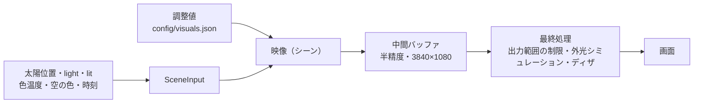

# 映像表現：効果と自然現象

visuals モードで作っている映像（シーン）について、「どの自然現象を手がかりにしているか」「どう実装しているか」「どこまでが物理に基づき、どこからが見た目のための近似か」をまとめたもの。
太陽位置の計算と光の向き（`light`）は [verification.md](verification.md)、使い方は [README](../README.md) を参照。

- 対象コード：`src/scenes/`（映像）、`src/stage.ts`（描画の本体）
- 各映像の「重さ」は Apple M4（GPU 10 コア）、3840×1080 でのベンチマーク値（10 章）

> **読み方の注意**：ここでの映像は物理シミュレーションではなく、**現象の見え方を手がかりにした表現**である。各章の「物理との対応」の表で、物理に基づいている部分（◯）と見た目のための近似（△）を区別している。

---

## 1. 共通の仕組み

### 1.1 3 つのモード

| モード | 役割 | 表示する映像 |
|---|---|---|
| verify（検証） | 計算の検証。平面図・高度グラフ・計算値 | 検証用の映像（light-debug） |
| visuals | 映像の制作・調整。調整パネル・プレビュー・性能計測 | パネルで選んだ映像 |
| kiosk（展示） | 本番の出力。3840×1080 の枠なしウィンドウ | visuals で保存した映像と調整値（`config/visuals.json`） |

URL の `?scene=ID` で映像を一時的に切り替えられる（保存はしない）。

### 1.2 描画の流れ



- **中間バッファは半精度（16bit 浮動小数）**：大きなグラデーションを 8bit に落とすときの縞（バンディング）を減らす。最後にディザ（1/255 程度の乱数）を足して 8bit に出す。
- **出力範囲の制限**：外光の下で純黒・純白を避ける（既定 0.05〜0.93）。全映像に共通でかかる。
- **外光シミュレーション**（visuals のプレビューのみ）：投影像に外光が重なると、黒が浮いてコントラストと彩度が落ちる。`表示色 = mix(映像の色, 外光の色, 強さ)` で近似し、「日差しに連動」では強さを `0.35 + 0.65 × lit` 倍する。

### 1.3 映像が受け取る値（SceneInput）と日差しとの関係

| 値 | 内容 | 物理との関係 |
|---|---|---|
| `sun` | 太陽の方位角・高度・赤緯・均時差 | ◯ 天文計算（verification.md 4 章） |
| `light` | 光の進む向き（スクリーン座標）、`windowIncidence`、`entersWindow` | ◯ ベクトルの射影（verification.md 5 章） |
| `lit` | 窓から光が入る度合い 0〜1。`min(1, windowIncidence × 3)` を約 0.5 秒で追従 | △ 入射角の cos に比例させた演出上の値 |
| `kelvin`, `lightColor` | 太陽高度から決めた光の色温度（約 2000〜5800K）と RGB | △ 夕方ほど赤いという傾向（大気を通る距離が長いほど青い光が散乱で失われる：レイリー散乱）を目安の表で表現 |
| `sky` | 太陽高度から決めた空の色 | △ 目安の色の表 |
| `localMinutes`, `time`, `dt` | 現地時刻、起動からの秒数、フレーム間隔 | ― |

照度センサーや気象庁データを加えるときは、ここに項目を足すだけで全映像から使える。

### 1.4 実装上の約束

| 約束 | 理由 |
|---|---|
| 色は **sRGB の値のまま**扱う（`THREE.Color` を使わない） | `THREE.Color` は sRGB の値を線形色空間に変換するため、そのまま渡すと色が暗くくすむ（実際に起きたバグ） |
| 時間で流す値は CPU 側（倍精度）で計算し、`wrap()` で **256 以内に巻き戻して** GPU に渡す | GPU の 32bit 浮動小数は数日分の秒数を正確に表せず、動きがカクつく |
| ノイズは **256 マスごとに繰り返すタイル化ノイズ** | 巻き戻した瞬間に模様が飛ばない |
| 周期的な動き（水滴の成長、垂れの伸び縮み等）は **1200 秒の周期内で整数回**になるようにする | 周期で時間を巻き戻しても継ぎ目が出ない |
| 画像の効果は **「画像を受け取って画像を返す」同じ形**（`vec3 effect(uv, p)`） | 後で効果を重ねるとき、前の効果の出力を次の入力につなぐだけで済む |

---

## 2. 検証用・ひな形の映像

### 2.1 検証用：光の向き（`light-debug`）

窓側の画面端が明るく、光の進む向きへ暗くなる光の広がりと、窓枠の影の縞（任意）。計算した光の向きを目で確かめるための表示。

主なパラメータ：光の強さ、窓枠の影、窓枠の間隔(px)、影の濃さ、揺らぎ。

### 2.2 ひな形：光の時計（`color-field`）

画面全体の色面グラデーションが、光の向きと太陽高度に合わせて移ろう。新しい映像を作るときのひな形。

主なパラメータ：光の色の強さ、グラデーションの幅、揺らぎ、揺らぎの速さ、奥側の色を指定、奥側の色。

---

## 3. にじみ（`ink-bleed`）

紙に染み込んだ色が、光の進む向きへゆっくり広がる。先端には色が溜まり、虹色に分離する。
リファレンス：水彩のにじみ、ペーパークロマトグラフィーのような作品（Pinterest）。

### 3.1 元にした現象

**毛細管現象による浸透**
紙は細い繊維のすき間の集まりで、水は表面張力によってすき間を吸い上げられて広がる（毛細管現象）。浸透した距離は、ルーカス・ウォッシュバーンの式で時間の平方根に比例する。

```
L = √( γ · r · cos θ · t / (2μ) )     γ：表面張力、r：すき間の半径、θ：接触角、μ：粘度、t：時間
```

紙の繊維の分布は不均一なので、進む速さが場所ごとに違い、先端は波打った形（指状の凹凸）になる。

**コーヒーリング効果（縁に色が溜まる）**
にじみの縁（液の端）は紙に固定されたまま乾いていく。縁は薄いので中央より速く蒸発し、それを補うために、液の内側から縁へ向かう流れが生まれる。流れに運ばれた顔料が縁に溜まるので、縁が濃く暗くなる（Deegan ら, *Nature*, 1997）。凹んだ所では流れが集まるので、さらに溜まりやすい。

**ペーパークロマトグラフィー（色が分かれる）**
インクは複数の色素の混合物である。水と一緒に紙を上っていくとき、色素ごとに紙（固定相）への吸着のしやすさが違うので、進む速さが変わる。その結果、黄・赤・青などの帯に分かれる（進んだ距離の比を Rf 値という）。

**顔料の粒（グラニュレーション）**
重い顔料の粒は、紙の凹みに沈んで溜まる。そのため、紙の目に沿った粒状のむらが出る。

### 3.2 実装

| 要素 | 実装 |
|---|---|
| 広がる向き | `light` の画面内の向き（`dirX`, `dirY`）にゆっくり追従（約 2 秒）。オフにすると固定の角度 |
| 先端の位置 | 画面の入り口側から出口側までの位置（パラメータ）＋ゆっくりした満ち引き（正弦波、既定 4 分周期） |
| 先端の輪郭 | 大きなうねり（fbm ノイズ）＋外側へ丸く膨らむ凹凸（`|sin|^0.7`、間隔と大きさを不揃いに）＋繊維のけば立ち（細かいノイズ、数 px） |
| 帯 | 帯が並ぶ向きの余弦波をノイズで揺らし、帯ごとに太さと濃さを不揃いにする。奥ほど薄く溶ける |
| 縁の色 | 内側の境界はなめらかな線、先端は凹凸の線とし、その間を 0〜1 の位置 k で表す。k を「黄 → 橙 → マゼンタ → 青 → 紺」の色に対応させる |
| 紺の溜まり | ノイズと「凹み具合」（湾ほど大きい）で溜まる場所を決め、溜まる所だけ先端が紺まで届く。溜まらない所は先端がマゼンタや橙で止まる |
| 紺のにじみ | 紺が溜まる所から内側へ、指数関数的に薄くなる青の層を重ねる |
| 色の分離 | 色の成分（R, G, B）ごとに k を少しずらす（縁の内側だけ。外へははみ出さない） |
| 白い抜け | ノイズで縁が薄く細くなる所を作る |
| 半透明・粒 | 紙の色に絵の具の色を掛け合わせる（乗算）。紙の凹凸（数 px）と中くらいのむら（数十 px）で絵の具の乗り方を変える |
| 日差しとの連動 | `lit` が小さいときは、濃さは保ったまま鮮やかさ（彩度）と色の分離を落とす |

### 3.3 物理との対応

| 現象 | 対応 | 補足 |
|---|---|---|
| 先端が凹凸になる（不均一な浸透） | △ | 凹凸の形はノイズと正弦波で作っている。浸透の計算はしていない |
| 広がる速さ | △ | ルーカス・ウォッシュバーンの √t ではなく、ゆっくりした満ち引き（正弦波）。展示で延々と続けるため |
| 縁が濃い（コーヒーリング効果） | ◯ 考え方 / △ 実装 | 「縁ほど濃い」「湾ほど溜まる」という傾向を反映。流れの計算はしていない |
| 色が分かれる（クロマトグラフィー） | △ | 色の順番と分離の見た目を再現。色素ごとの Rf 値は扱っていない |
| 顔料の粒 | △ | ノイズによる見た目の再現 |

### 3.4 主なパラメータ

光の向きに広がる、先端の位置、満ち引きの幅・周期、輪郭のうねり、縁の凹凸・細かさ・けば立ち、縁の太さ・濃さ、紺の溜まり、紺のにじみ、縁の色むら、縁の白い抜け、虹色の分離、日差しで鮮やかに、帯の数・ぼかし・濃さ、染み込みの長さ、顔料の粒、紙の質感、紙の色・帯の色（4 色）、時間帯の色を使う。

---

## 4. 光の柱（`light-columns`）

固定された縦の光の筋（柱）が加算的に輝き、背景には重なるカラーバンドがうねる。柱の縁は虹色ににじむ。
リファレンス：彩度の高い色面と、縁が虹色ににじむ縦の光の筋（Pinterest）。

### 4.1 元にした現象

**光の加算混色**
絵の具や染料の色は、光を吸収することで色がつく「減法混色」で、重ねるほど暗くなる。一方、光そのものは重なると強さが足し合わさる「加算混色」で、重なるほど明るくなり、飽和すると白に近づく。ネオンサインや光源の多重露光写真、光を描くように動かして撮る「ライトペインティング」などで見られる性質。

**補色は重ねると白になる**
色相環で向かい合う 2 つの色（補色）の光を重ねると、無彩色（白）になる。これは色再現の基本的な性質で、例えば青い光と黄色い光を重ねると白色光に近づく。柱の色は、そこを横切っている背景色の補色（RGB を反転させた色、`vec3(1.0) - 背景色`）にした。こうすると、柱は通る場所の背景色によって違う色を帯び、かつ輝きが強い部分では「背景色 + その補色 = 白」という関係で自然に白へ収束する。参考画像で、柱が横切るカラーバンドごとに違う色に見え、輝きが強い芯の部分は白く飛んでいるのは、この「補色の重なりが白になる」現象の見た目だと解釈した。

**スリット・エッジでの色のにじみ（色収差・回折）**
明るい光源を細いすき間ごしに見たり撮ったりすると、縁が虹色ににじむ。原因は主に、レンズの色収差（波長ごとに屈折率が違うため、レンズを通る位置がわずかにずれる）と、細いすき間での回折（波長が短いほど広がり方が小さい）。アナログ写真で光が漏れて写り込む「light leak」にも、同様の虹色のにじみが伴うことが多い。分光（7.2 節、`img-prism`）で使った「波長ごとに屈折率が違う」という考え方をここでも近似として流用している。

**会場のガラスの継ぎ目**
設置場所のガラスパーティションには実際に縦の継ぎ目がある。継ぎ目の位置は光の向きが変わっても動かないため、柱は「光の向きに関わらず固定の縦位置」にした。継ぎ目そのものを物理的に光らせているわけではなく、継ぎ目を手がかりにした演出上の要素として扱っている。

### 4.2 実装

| 要素 | 実装 |
|---|---|
| 背景のカラーバンド | 4 色を三角基底で周期的に混ぜ、y 方向の位相を fbm ノイズでうねらせる（既定 4 帯） |
| 柱の位置 | 画面の x 座標を一定間隔で区切り、間隔ごとに位置をランダムにわずかにずらして不揃いにする |
| 柱の明るさの形 | ごく細い「芯」（`smoothstep` で作った、白く飛ぶ部分）と、そのすぐ外側で最大になる幅広い「輪」（補色の色味を残す部分）の 2 段構え |
| 柱の色 | 芯は白。輪は、その場所の背景色の補色（`vec3(1.0) - 背景色`）。輪の強さは 1 未満で頭打ちにし、白飛びさせず色味を残す |
| 輪の縁の虹色のにじみ | 輪の外径を RGB で変える（赤を広く・青を狭く）。分光と同じ考え方の近似 |
| 揺らめき | 柱ごとにノイズで輝きを揺らす |
| 合成 | `col = col + 補色 × 輝きの度合い`（真の加算）。輝きの度合いを 0〜1 に収めているので、`背景色 + 補色 × 輝き ≦ 背景色 + 補色 = 白` となり、計算上白飛びしない |
| 日差しとの連動 | 「日差しで光条が輝く」ON で芯の白飛びが `lit` に比例。「時間帯の色を使う」ON で帯の色に `sky`・`lightColor` を使う |

### 4.3 物理との対応

| 現象 | 対応 | 補足 |
|---|---|---|
| 光の加算混色・補色は重ねると白になる | ◯ 考え方 / △ 実装 | 「補色を重ねると白になる」という関係は `色 + (1-色) = 白` として厳密に成り立たせているが、「補色」を波長ベースではなく RGB の反転で近似している点は簡略化 |
| 縁の虹色のにじみ（色収差・回折） | △ | 輪の外径を RGB ごとに変えるだけの近似。回折・色収差そのものは計算していない |
| 柱の位置（ガラスの継ぎ目） | ◯ 考え方 / 未実装 | 実際の継ぎ目を意識した固定位置だが、間隔・位置は現地未計測。プレビューのガイド線（`config/visuals.json` の `guides.seamOffsetPx`／`seamSpacingPx`）とは今のところ連動していない独立したパラメータ |
| 背景のカラーバンド | △ | 色そのものに物理的根拠はなく、彩度の高い色面の演出 |

### 4.4 主なパラメータ

帯の数、帯のうねり、うねりの速さ、時間帯の色を使う、色 1〜4、柱の間隔(px)、柱の位置のばらつき、柱の太さ(px)、虹色のにじみ、柱の基本の輝き、日差しで光条が輝く、輝きの強さ、揺らめき、揺らめきの速さ。

---

## 5. 光の雲（`light-clouds`）

ゆっくり流れながら形を変える雲を、窓から差す光が照らす。光は画面の外、光が来る側にあり、そこに近い雲ほど明るく、光の色に染まる。日差しがない時間も、雲は空の光でうっすら見える。色の光の点が雲の中を動き回る表現（光の点）も入れてあるが、既定ではオフ。
リファレンス：3 次元ノイズを重ねた雲を、動く色の光の点が照らす Shadertoy のシェーダー（ノイズ関数以外のコードは写さず、書き直している。11 章）。

### 5.1 元にした現象

**雲が白く見えるわけ（ミー散乱）**
雲の水滴（直径 数〜数十 µm）は光の波長（0.4〜0.7 µm）よりずっと大きいので、どの色の光もほぼ同じように散乱する（ミー散乱）。そのため雲は、照らす光の色をそのまま返す。朝夕の橙色の光に照らされた雲は橙色に、昼の白い光では白くなる。この映像では、雲の色＝照らす光の色（`lightColor`）とした。

**太陽に近い雲ほど明るい（前方散乱）**
大きな粒子の散乱は、光の進む向きに強く偏る（前方散乱）。太陽の近くにある雲や、雲の縁が明るく輝いて見える（「シルバーライニング」）のはこのため。この映像では、光のある位置（画面の外、光が来る側）に近い雲ほど明るくした。

**空の光で見える雲**
太陽が隠れていても雲が見えるのは、空全体からの光（天空光）が雲を照らしているから。日差しが窓から入らない時間でも、雲は空の色の光でうっすら見えるようにした（「空の光で見える雲の明るさ」）。

**雲の形（フラクタル）**
雲の輪郭は、大きさを変えても似た入り組み方が現れる（自己相似、フラクタル）。衛星写真・レーダーでの雲の面積と周囲の長さの関係から、輪郭のフラクタル次元は約 1.35 と報告されている（Lovejoy 1982）。この映像では、大きさを半分ずつにしたノイズを重ねる方法（フラクタル・ブラウン運動、fBm）で、この入り組み方を作っている。

### 5.2 実装

| 要素 | 実装 |
|---|---|
| 雲の濃さ | 3 次元シンプレックスノイズ（webgl-noise、MIT ライセンス）を、大きさを約半分・強さを半分ずつにして重ねる（既定 5 層、1〜6 層）。3 つ目の軸を時間で進めると形が変わる。細かい層ほど速く形が変わる |
| 雲の流れ | ノイズの位置を一定の向きへずらす（「流れる向き」「流れる速さ」）。速さを変えても雲の位置が飛ばないよう、毎フレームの増分を足していく |
| 長時間の稼働 | ずらす量が大きくなると GPU の小数の精度が落ちてカクつくので、量が 200 を超えたら、0 から始めた同じ動きの雲へ 40 秒かけて移り、移り終えたら量を巻き戻す。移っている間は 2 つの雲を、濃さのばらつきが変わらない重み（`(a(1-w) + bw) / √((1-w)² + w²)`）で混ぜるので、薄くならない。`tests/light-clouds.test.ts` で、何時間動かしても量が上限内に収まり、つなぎ目で飛ばないことを確認 |
| 窓から差す光 | 光のある位置を、画面の中央から光の進む向きの逆へ、画面の縁を越える所まで離して置く。明るさ = 光の強さ × `exp(−距離 / 光の届く広さ)`。雲の濃い所ほどこの光を受けて光り、雲のない所も「雲のない所の光」の割合だけうっすら光る（空気中の散乱の見立て） |
| 背景 | 空の色（`sky.bottom` → `sky.top`）× 背景の明るさ。雲には空の光のぶんも足す |
| 光の点（既定オフ） | 3 つの点が、向きと速さの違う円運動を組み合わせた道筋で画面を回る。点のまわりの雲が点の色に照らされ（距離に比例して弱まる）、点そのものは `大きさ / 距離` で光る |
| 出し消し | 雲・窓から差す光の向き・時間帯の色・日差しの強さ・光の点を、それぞれパネルのスイッチで切り替えられる（5.4 節） |

### 5.3 物理との対応

| 現象 | 対応 | 補足 |
|---|---|---|
| 光の来る向き | ◯ | `light.dirX/dirY`（太陽の位置から計算した、画面の中で光が進む向き）から、光のある位置を決める |
| 雲の色 = 照らす光の色（ミー散乱） | ◯ 考え方 / △ 実装 | 雲の色に `lightColor` をそのまま使う。光の色そのものが目安の表の値（1.3 節） |
| 太陽に近い雲ほど明るい（前方散乱） | △ | 散乱の角度分布（位相関数）は計算せず、光のある位置からの距離で指数的に弱める近似 |
| 空の光で見える雲 | △ | 空の色の平均を一様に足すだけ |
| 雲の形（フラクタル） | △ | fBm で見た目の入り組み方を似せているだけで、雲の物理（上昇気流・凝結）は計算していない |
| 雲の厚みによる影（雲の下側が暗い、など） | 未実装 | 光が雲の中を通るときの減衰は計算していない。濃い所ほど明るくなるだけ |
| 雲の流れ・形の変化の速さ | △ | 見た目の速さ。風速との対応はない |
| 光の点 | △ | 演出上の要素。日差しとは連動しない |

### 5.4 主なパラメータ

| まとまり | パラメータ |
|---|---|
| 雲 | **雲を表示**（オン・オフ）、雲の細かさ、雲の重ね数（多いほど細部まで・重い）、雲の量、雲の輪郭のくっきりさ、流れる速さ、流れる向き、形の変わる速さ |
| 窓から差す光 | **光の向きに合わせて照らす**（オフで画面の上の中央から照らす）、光の強さ、光の届く広さ、雲のない所の光、**日差しの強さで明るさが変わる**（オフで `lit` の影響なし） |
| 色 | **時間帯の光・空の色を使う**（オフで光の色・空の色（上・下）を指定）、背景の明るさ、空の光で見える雲の明るさ |
| 光の点 | **光の点を表示**（既定オフ）、光の点の大きさ、光の点が雲を照らす広さ、光の点の速さ、光の点の色 1〜3 |

太字はオン・オフのスイッチ。

---

## 6. 画像を元にした効果（共通）

`src/img/sea.jpg`（4032×3024）を元に、光や水の現象でゆがませ、にじませる。
リファレンス：萩原拓也、Kim Asendorf の作品など（Pinterest）。

- **切り出し**：写真（4:3）を横長の画面（32:9）いっぱいに切り出す。「画像の表示位置」（縦）と「画像の拡大」は全効果に共通のパラメータ
- **端の処理**：ゆがませて画像の外を読むと、端で折り返して自然につながる（鏡映しの繰り返し）
- **ぼかし**：ミップマップ（あらかじめ縮小した画像の段）を使った安価なぼかし（`imgLod`）
- **後で混ぜる準備**：各効果は `vec3 effect(uv, p)` という同じ形で、元画像を読む `img()` を前の効果の出力に差し替えれば重ねられる

---

## 7. 各効果

### 7.1 結露・水滴（`img-droplets`）

曇ったガラスに水滴がつき、ゆっくり育っては消える。水滴の中は景色が屈折して見え、縁が光る。投影面がガラスの間仕切りなので、作品のコンセプトと直接つながる。

**元にした現象**
- **結露**：ガラスの表面温度が空気の**露点温度**より低いと、空気中の水蒸気がガラスの上で水滴になる。露点温度は、気温と相対湿度からマグヌスの式で求められる。

  ```
  γ = ln(RH/100) + b·T/(c+T)     露点 Td = c·γ / (b − γ)     （b = 17.625, c = 243.04℃。Alduchov & Eskridge 1996）
  ```

- **曇り**：ごく小さな水滴が無数につくと、光が水滴の大きさと同程度の波長で散乱し（ミー散乱）、景色がぼけて白っぽく見える。
- **水滴の成長と合体**：水滴は凝結で大きくなり、隣と触れると表面張力で一つにつながる（合体）。
- **水滴はレンズ**：水（屈折率 約 1.33）の水滴は平凸レンズのように働き、後ろの景色を屈折させる。縁ほど表面の傾きが大きいので、強く曲がる。縁では反射した光が集まり、明るい輪や暗い輪が見える。

**実装**
- 画面をマス目に分け、マスごとに水滴の中心・大きさ・寿命（ゆっくり育って消える）を乱数で決める
- 水滴の場を**メタボール**（各水滴の「r²/距離²」の和）で作る。和が 1 以上を水滴の中とすると、近い水滴が自然につながる（合体の見た目）。大小 2 種類の水滴を重ねる
- 水滴の中：場の勾配（表面の傾きの代わり）に沿って読む位置をずらす。縁ほど大きくずらす
- 水滴の外：ミップマップでぼかした画像に、曇りの色を混ぜる
- 縁：場の値が 1 を少し超えた所に明るい輪、1 の手前に細い影
- 日差しとの連動：縁の光を `0.4 + 0.6 × lit` 倍する

| 現象 | 対応 | 補足 |
|---|---|---|
| 結露の条件（露点） | 未実装 | 気象庁の気温・湿度から露点を求め、「曇り」「水滴の多さ」に反映できる（次の段階） |
| 曇り（散乱によるぼけ） | △ | ぼかしと白の混合で近似 |
| 水滴の合体 | △ | メタボールでつながる見た目を再現。表面張力の計算はしていない |
| 水滴のレンズ | △ | 勾配に沿ってずらす近似。光線追跡（スネルの法則による屈折）ではないので、景色の上下反転は起きない |
| 縁の光 | △ | 輪として描いている |

主なパラメータ：曇り（湿度）、曇りのぼけ、水滴の大きさ・多さ、小さな水滴、屈折の強さ、縁の光・色、日差しで縁が光る、曇りの色。

### 7.2 分光（プリズム）（`img-prism`）

型板ガラスやリブガラス越しに見たように景色がゆがみ、輪郭が虹色に分かれる。日差しが入ると、光の向きに色が分かれる。

**元にした現象**
- **屈折（スネルの法則）**：光は屈折率の違う物質の境目で曲がる。`n₁ sin θ₁ = n₂ sin θ₂`（ガラスの屈折率は約 1.5）
- **分散**：屈折率は波長によって違い、**波長が短いほど大きい**（コーシーの式 `n(λ) = A + B/λ²`）。そのため紫の光ほど強く曲がり、白い光が虹色に分かれる。ガラスの分散の小ささはアッベ数で表す（一般的な板ガラスで 55〜65 程度）
- **型板ガラス・リブガラス**：表面の凹凸や縦溝（円柱状のレンズが並んだもの）が、場所ごとに違う向きに光を曲げる

**実装**
- ガラスの厚みの傾きを、ゆっくり動く fbm ノイズの勾配（型板ガラス）と、光の向きに並ぶ半円柱の傾き（リブガラス）の混合で作る
- 傾きに比例して読む位置をずらす。日差しが入るときは、光の向きにもずらす
- **9 つの波長**（紫〜赤）ごとに、ずらす量を変えて画像を読み、波長ごとの RGB の重み（おおまかな等色関数）を掛けて足す。重みの合計で割るので、白は白のまま
- 紫ほど大きくずらす（屈折率が大きい）

| 現象 | 対応 | 補足 |
|---|---|---|
| 屈折 | △ | 傾きに比例したずらしで近似（スネルの法則は直接計算していない） |
| 分散の向き（紫ほど強く曲がる） | ◯ | 波長が短いほど大きくずらす |
| 分散の大きさ | △ | 実際のガラスよりかなり誇張している（パラメータ「色の分かれ方」） |
| 波長 → 色 | △ | おおまかな等色関数 |

主なパラメータ：屈折の強さ、色の分かれ方、リブガラスの度合い・本数、うねりの大きさ・動き、日差しでの分光、日差しに連動。

### 7.3 水面（`img-water`）

水平線の下に景色が映り込み、遠近のついた波で揺れる。オフにすると、水越しに見た屈折の揺れになる。

**元にした現象**
- **フレネル反射**：水面で反射する光の割合は、見る角度で変わる。真上から見るとわずか約 2%、水面すれすれ（水平線近く）ではほぼ 100% に近づく。遠くの水面ほど鏡のように景色を映す
- **波による映り込みの伸び**：波の斜面はそれぞれ違う向きを向いているので、映る位置が上下にずれる。重なると、映り込みが縦に伸びた光の筋になる（夕日の光の道と同じ仕組み）
- **遠近**：遠くの波ほど小さく細かく、手前ほど大きく粗く見える

**実装**
- 水平線の下の点について、水平線からの距離（深さ）を使い、波の模様を「手前ほど大きく、遠いほど細かく」する座標で読む
- 水平線を軸に折り返した位置の景色を、波でずらして読む。縦に 10 点を平均して、映り込みを縦の筋にする
- 波の斜面の向きで明暗を付ける（空の明るい所・暗い所が映る）
- 反射の強さを、水平線に近いほど大きくする

| 現象 | 対応 | 補足 |
|---|---|---|
| フレネル反射（水平線ほど強く映る） | ◯ 傾向 / △ 値 | 傾向は再現。値は 0.35〜1 の演出値で、真上 2% という物理値ではない |
| 映り込みが縦に伸びる | ◯ 仕組み / △ 実装 | 波で映る位置がずれる、という仕組みを縦方向の平均で近似 |
| 遠近 | △ | 深さに応じた座標変換 |
| 波の形 | △ | ノイズ。風速から波の大きさを求める計算はしていない（気象庁の風速を使う余地がある） |

主なパラメータ：映り込み／水越しの屈折、水平線の高さ、波の強さ（風）・細かさ・速さ、光の筋の長さ、映り込みの強さ、手前の暗さ、水の色。

### 7.4 光のにじみと等高線（`img-glow-contour`）

明るい所から光があふれて伸び、暗い所（海や浜）が地形図のように色分けされる。

**元にした現象**
- **光の散乱・ハレーション**：明るい光は、大気中の粒子（霧・もや）や、目・レンズの中で散乱し、周りへにじむ
- **等値線**：高さの等しい点を結んだ等高線、気温の等しい点を結んだ等温線、気圧の等圧線のように、連続した量の分布を線と段で表す方法。サーモグラフィーのような色分けも同じ考え方

**実装**
- にじみ：伸ばす向き（既定は下、または光の向き）に沿って、だんだん強くぼかしながら 12 点を重ねる。しきい値より明るい部分を足して「あふれ」を作る
- 等高線：強くぼかした画像の明るさを「高さ」に見立て、段数で区切って色分けし、段の境目に線を引く（線の太さは画面上のピクセルで揃える）。しきい値より暗い所だけを地形図にする

| 現象 | 対応 | 補足 |
|---|---|---|
| 光の散乱 | △ | 方向性のあるぼかしで近似 |
| 等値線 | ◯ 考え方 | 明るさという連続量を等値線で表す。気象庁の気温・気圧を等値線で描くことにも使える |

主なパラメータ：にじみの長さ・混ざり、光の向きににじむ、光のあふれ・あふれる明るさ、等高線の強さ・にする暗さ・段数・線の太さ、地形のなめらかさ、等高線の揺らぎ・速さ。

### 7.5 陽炎（`img-heat-haze`）

地面付近の景色が揺らいで上へのぼり、地面すれすれには空が映る（逃げ水）。太陽が高く日差しがあるほど強い。

**元にした現象**
- **空気の屈折率と温度**：空気の屈折率は密度に比例して 1 からわずかに大きく（`n − 1 ∝ 密度`、グラッドストン・デールの関係）、温度が高いほど密度が低いので屈折率が小さい
- **陽炎**：日差しで温まった地面から、温かい空気の塊が上昇する（対流）。屈折率の違う空気の塊が揺らぎながら流れるので、その向こうの景色が揺れて見える
- **逃げ水（下位蜃気楼）**：地面すれすれの空気が特に熱いと、光は屈折率の大きい上の空気へ向かって曲がる。空からの光が地面近くで上へ曲がって目に届くので、地面に空（水たまりのような像）が映る
- **地面が受ける日射**：水平な地面が受ける日射の強さは、太陽高度 h に対して `sin h` に比例する（ランベルトの余弦則）

**実装**
- 地面の高さから上へ指数関数的に弱まる揺らぎの強さ
- 上へ流れる縦長のノイズで読む位置をずらす
- 地面のすぐ下に、地面を軸に折り返した景色を混ぜる（逃げ水）
- 日差しとの連動：強さ × `0.25 + 0.75 × √(sin h) × (0.4 + 0.6 × lit)`

| 現象 | 対応 | 補足 |
|---|---|---|
| 日射の強さ（sin h） | ◯ | ランベルトの余弦則に基づく。√ は見た目の調整 |
| 揺らぎ（対流による屈折率の変化） | △ | ノイズで近似。屈折の計算はしていない |
| 逃げ水 | △ | 折り返しの混合で近似 |

主なパラメータ：揺らぎの強さ、地面の高さ、揺らぐ高さ、揺らぎの細かさ、のぼる速さ、逃げ水、日差しと太陽高度に連動。

### 7.6 垂れる流れ（`img-drip`）

空など明るい所の色が、下へ垂れて丸い滴になり、ゆっくり伸び縮みする。リファレンス：萩原拓也の作品の、オレンジの色が垂れる表現。

**元にした現象**
- **重力による薄い液体の流れ**：垂直な面を流れ落ちる液体の速さは、重力・液の厚み・粘り気で決まる（厚いほど、粘り気が小さいほど速い）
- **先端の滴**：流れの先端には液が溜まり、表面張力で丸くなる。重力が表面張力に勝つと、滴がちぎれて落ちる（レイリー・プラトー不安定性。重力と表面張力の比はボンド数で表す）

**実装**
- 画面を縦の細い帯に分け、帯ごとに「垂れるか」「長さ」「伸び縮みの周期」を乱数で決める
- 各ピクセルから上流へ最大 28 回たどり、最初に見つかった明るい所の色をコピーして、べた塗りの筋にする
- 先へ行くほど筋を細くし、先端に丸い滴を付ける

| 現象 | 対応 | 補足 |
|---|---|---|
| 重力で流れる | △ | 速さは物理から求めておらず、乱数の周期で伸び縮みさせている |
| 先端の滴 | △ | 筋の太さに比例した固定の円。表面張力の計算はしていない |
| 流れの経路・合流 | 未実装 | 真っすぐな帯のみ |

**より物理に沿わせるには**：前のフレームの結果を積み重ねる方式（フィードバック）で、液体の流れと滴がちぎれる様子をシミュレーションする。描画の仕組みの拡張が必要。

主なパラメータ：垂れる長さ、垂れる明るさ、暗い所を垂らす、筋の太さ・多さ、濃さ、光の向きに垂れる。

### 7.7 ピクセルの引き伸ばし（`img-pixel-stretch`）

画像の一部のブロックが、縦（または横）に引き伸ばされた筋になる。四角く硬いデジタルのグリッチの見た目。リファレンス：Kim Asendorf の作品。

**元にした手法**
- **ピクセルソート**：Kim Asendorf が 2010 年に公開した「ASDFPixelSort」で広まった手法。画像を 1 列ずつ見て、明るさなどの条件で区間を決め、区間内のピクセルを明るさの順に並べ替える
- これは自然現象ではなくアルゴリズムによる表現である。この作品では、並べ替えの向きを「水が流れ落ちる向き」に見立てている

**実装（引き伸ばし方式：並べ替えの簡易版）**
- 画面を長方形のブロックに分け、効果をかけるブロックを選ぶ。どのブロックにかかるかは、ゆっくり入れ替わる
- 1 列ずつ、明るさが範囲内のピクセルが続く区間を見つけ、区間を上流端の色で埋める。粗く探したあと二分探索で境目を絞り込むので、同じ区間はすべて同じ色になる
- ブロックの境目で区間を切るので、四角い塊になる。1 列ずつ別々に処理するので、筋の中に細い縞が残る
- 一部のブロックは横に引き伸ばす
- 日差しとの連動：日差しが強いほど、引き伸ばす明るさの範囲を広げる

| 項目 | 対応 | 補足 |
|---|---|---|
| ピクセルソート | △ | 並べ替えではなく引き伸ばし（区間の端の色で埋める）。本来の並べ替え方式は、裏の処理（Web Worker）で数秒おきに計算する予定 |

主なパラメータ：引き伸ばす明るさの下限・上限、反転、区間の最大長さ、筋の太さ、ブロックの大きさ、かかるブロックの割合、横に伸ばすブロックの割合、ブロックの入れ替わり、光の向きに伸ばす、日差しで範囲が広がる。

---

## 8. 日差しの値の使い方（映像ごとの一覧）

実際にコードを確認して、日差し関連の値がどこで使われているかをまとめたもの。8.2 節は「値ごとに、どの映像のどのパラメータがそれを使っているか」を表にしている。

### 8.1 全映像に共通する計算の流れ

毎フレーム、`config/site.json`（緯度経度・スクリーンと窓の向き）と現在時刻（または検証・visuals で指定した時刻）から、次の順で値を作り、`SceneInput` として各映像に渡す。

```plain text
太陽の位置 sun ──→ 光の向き light（スクリーン座標）
      │                        │
      │ 太陽高度から           窓からの入り具合
      ├─ 色温度 kelvin → 光の色 lightColor    lit = 入る場合 min(1, windowIncidence × 3)、
      └─ 空の色 sky                            そうでなければ 0
                                                （約 0.5 秒かけて追従。急に変わらない）
```

| 値 | 中身 | 性質 |
|---|---|---|
| `light.dirX`, `light.dirY` | 窓から差す光が画面の中で進む向き | 太陽の方位・高度と部屋の向きから計算した、物理的に正しい値（verification.md 5〜6 章） |
| `lit` | 窓から光が入っている度合い（0〜1） | 太陽が窓の正面に近いほど大きい。窓から入らない時間帯は 0 |
| `sun.altitude` | 太陽高度（度） | 天文計算の値（verification.md 4 章） |
| `lightColor`, `sky` | 太陽高度から決めた光・空の色 | 目安の色の表から決めた演出上の値（1.3 節） |

### 8.2 値ごとに見る：どのパラメータと連動しているか

前節の 4 つの値ごとに、パネルのどのパラメータがそれを使っているかをまとめたもの。パラメータ名はパネルに表示される日本語表記のとおり。「連動の状態」が**切替可**のものは、パネルでオン・オフを切り替えられる（オフにすると、その値の代わりに固定値を使う）。

**A. 光の向き（`light.dirX`, `light.dirY`）**

<table header-row="true">
<tr><td>映像</td><td>連動の状態</td><td>パラメータ（パネル表示）</td><td>オンのとき</td><td>オフのとき</td></tr>
<tr><td>検証用：光の向き</td><td>常時（切替なし）</td><td>―</td><td>光の広がる方向、窓枠の影の向きに使う</td><td>―</td></tr>
<tr><td>光の時計</td><td>常時（切替なし）</td><td>―</td><td>グラデーションの傾きに使う</td><td>―</td></tr>
<tr><td>にじみ</td><td>切替可・既定 ON</td><td>光の向きに広がる</td><td>にじみが広がる方向</td><td>固定の向き（「固定の向き（°）」パラメータ）</td></tr>
<tr><td>分光</td><td>切替可・既定 ON</td><td>日差しに連動</td><td>景色全体を光の向きへずらして色を分ける</td><td>光の向きの影響なし（`lit` の効果も含めて無効）</td></tr>
<tr><td>光のにじみと等高線</td><td>切替可・既定 OFF</td><td>光の向きににじむ</td><td>にじみを伸ばす方向</td><td>固定で下向き</td></tr>
<tr><td>垂れる流れ</td><td>切替可・既定 OFF</td><td>光の向きに垂れる</td><td>垂れる方向</td><td>固定で真下</td></tr>
<tr><td>ピクセルの引き伸ばし</td><td>切替可・既定 OFF</td><td>光の向きに伸ばす</td><td>引き伸ばす方向</td><td>固定で真下</td></tr>
<tr><td>光の雲</td><td>切替可・既定 ON</td><td>光の向きに合わせて照らす</td><td>光のある位置を、光が来る側の画面の外に置く</td><td>画面の上の中央の外から照らす</td></tr>
<tr><td>結露・水滴／水面／陽炎／元の写真／光の柱</td><td>未対応</td><td>―</td><td colspan="2">光の向きを使う仕組みがない</td></tr>
</table>

**B. 日差しの強さ（`lit`、0〜1）**

<table header-row="true">
<tr><td>映像</td><td>連動の状態</td><td>パラメータ（パネル表示）</td><td>オンのとき</td><td>オフのとき</td></tr>
<tr><td>検証用：光の向き</td><td>常時（切替なし）</td><td>―</td><td>光の広がりの明るさ・影の濃さに使う</td><td>―</td></tr>
<tr><td>光の時計</td><td>常時（切替なし）</td><td>―</td><td>色の混ざり具合 `0.35 + 0.65 × lit`</td><td>―</td></tr>
<tr><td>にじみ</td><td>切替可・既定 ON</td><td>日差しで鮮やかに</td><td>縁の鮮やかさ・色の分離に `lit` を使う</td><td>常に最大（1）扱い</td></tr>
<tr><td>結露・水滴</td><td>切替可・既定 ON</td><td>日差しで縁が光る</td><td>縁の光の強さ `0.4 + 0.6 × lit`</td><td>常に 1 倍</td></tr>
<tr><td>分光</td><td>切替可・既定 ON</td><td>日差しに連動</td><td>屈折の強さ `0.5 + 0.5 × lit`</td><td>常に 1 倍</td></tr>
<tr><td>陽炎</td><td>切替可・既定 ON</td><td>日差しと太陽高度に連動</td><td>揺らぎの式に `(0.4 + 0.6 × lit)` を含める</td><td>`lit` の影響なし</td></tr>
<tr><td>ピクセルの引き伸ばし</td><td>切替可・既定 ON</td><td>日差しで範囲が広がる</td><td>引き伸ばす明るさの範囲を `0.15 × lit` 広げる</td><td>広がらない（0）</td></tr>
<tr><td>光の柱</td><td>切替可・既定 ON</td><td>日差しで光条が輝く</td><td>柱の輝き = 基本の輝き + 輝きの強さ × `lit`</td><td>輝きの強さをそのまま使う（`lit` の影響なし）</td></tr>
<tr><td>光の雲</td><td>切替可・既定 ON</td><td>日差しの強さで明るさが変わる</td><td>窓から差す光の強さ = 光の強さ × `lit`（日差しが入らない時間は、空の光で見える雲だけになる）</td><td>光の強さをそのまま使う</td></tr>
<tr><td>光のにじみと等高線／水面／垂れる流れ／元の写真</td><td>未対応</td><td>―</td><td colspan="2">`lit` を使う仕組みがない</td></tr>
</table>

**C. 太陽高度（`sun.altitude`）**

<table header-row="true">
<tr><td>映像</td><td>連動の状態</td><td>パラメータ（パネル表示）</td><td>使い方</td></tr>
<tr><td>陽炎</td><td>切替可・既定 ON</td><td>日差しと太陽高度に連動</td><td>揺らぎの強さ × `0.25 + 0.75 × √(sin 太陽高度) × (…)`。オフで太陽高度の影響なし</td></tr>
<tr><td>他の全映像</td><td>間接のみ</td><td>―</td><td>太陽高度は `kelvin`・`sky`（色）の計算にのみ使われ、各映像はそこで作られた色を受け取るだけ。高度そのものを直接読む映像は陽炎のみ</td></tr>
</table>

**D. 光の色・空の色（`lightColor`, `sky`）**

<table header-row="true">
<tr><td>映像</td><td>連動の状態</td><td>パラメータ（パネル表示）</td><td>使い方</td></tr>
<tr><td>検証用：光の向き</td><td>常時（切替なし）</td><td>―</td><td>背景のグラデーション（`sky`）、光の広がりの色（`lightColor`）。効きの強さは `lit` で決まる</td></tr>
<tr><td>光の時計</td><td>常時（切替なし）</td><td>―</td><td>グラデーション両端の色。効きの強さは `lit` で決まる</td></tr>
<tr><td>にじみ</td><td>切替可・既定 OFF</td><td>時間帯の色を使う</td><td>ON→帯の色に `sky`・`lightColor` を使う／OFF→固定のリファレンス色（紙の色・帯の色 4 色）</td></tr>
<tr><td>結露・水滴</td><td>常時（切替なし）</td><td>―</td><td>縁の光の色に `lightColor` を 35% 混ぜる（縁の光自体の強さは B 表の「日差しで縁が光る」で制御）</td></tr>
<tr><td>光のにじみと等高線</td><td>常時（切替なし）</td><td>―</td><td>あふれる光の色に `lightColor` を 50% 混ぜる</td></tr>
<tr><td>光の柱</td><td>切替可・既定 OFF</td><td>時間帯の色を使う</td><td>ON→帯の色に `sky`・`lightColor` を使う／OFF→固定の色（色 1〜4）</td></tr>
<tr><td>光の雲</td><td>切替可・既定 ON</td><td>時間帯の光・空の色を使う</td><td>ON→雲を照らす光の色に `lightColor`、背景に `sky` を使う／OFF→指定した光の色・空の色（上・下）</td></tr>
<tr><td>分光／水面／陽炎／垂れる流れ／ピクセルの引き伸ばし／元の写真</td><td>未対応</td><td>―</td><td>色を使う仕組みがない</td></tr>
</table>

### 8.3 映像以外での使い方

- **外光シミュレーション**（visuals のプレビューのみ）：強さに `0.35 + 0.65 × lit` を掛け、外光の色に光の色を 40% 混ぜる
- **ログ**：長期稼働のログに、太陽の方位・高度、窓から入るか、`lit` を記録

### 8.4 分かっている課題

1. **「水面」が日差しとつながっていない**：太陽の方位に合わせた、水面に光る道（サンピラー、光の道）を加えると、実際の日差しと結びつけられる
2. **夜の光の向き**：光の向きは太陽が地平線の下にある夜も計算し続けている（夜は画面上で上向きになる）。そのため「光の向きに垂れる」などをオンにすると、夜は上へ垂れる。夜は向きを固定するなどの扱いが必要
3. **使っていない値**：太陽の方位角そのもの、光の奥行き成分（`light.z`）、赤緯、均時差は検証画面の表示にしか使っていない。`light.z`（光がスクリーンの奥へ向かうか手前へ向かうか）は奥行きの表現に使える余地がある
4. **気象庁データ・照度センサー**：まだどの映像にも入っていない。湿度を結露の「曇り」に、風速を水面の「波」に、気温を陽炎に、というようにつなぐ先の候補はある

---

## 9. 投影環境での注意

| 項目 | 内容 |
|---|---|
| 細かい表現 | 日差しの入るロビーでは、細い線や細かいノイズは潰れて見えにくい。筋の太さ・ブロックの大きさなどは太め・大きめにする |
| 明るい面 | 白が多いと眩しい。紙の色や曇りの色は中間的な明るさにする |
| 色の浅さ | 外光で色が浅くなる。visuals の外光シミュレーションで見当をつけ、最終的には現地の試写で合わせる |

---

## 10. 性能の計測

### 10.1 2 つの計測方法

| 方法 | 場所 | 内容 | 注意 |
|---|---|---|---|
| GPU 時間の表示 | visuals の状態表示、検証の計算値、長期稼働のログ | GPU のタイマー（`EXT_disjoint_timer_query_webgl2`）で、映像の描画と最終処理の時間を計る | macOS（Apple の GPU）では前後のフレームの処理が重なって計測され、値が大きく出る。「参考値」と表示する |
| ベンチマーク | visuals のパネル「性能 → ベンチマーク（60 フレーム）」 | 同じ映像を 60 フレーム続けて描き、GPU の処理が終わるまで待って 1 フレームの時間を出す | 計測中の約 1 秒は描画が止まる。どの環境でも実際の重さが分かる |

### 10.2 ベンチマーク結果（Apple M4、3840×1080）

| 映像 | 1 フレーム | 60fps に対する割合 |
|---|---|---|
| にじみ | 10.13 ms | 61% |
| 光の柱 | 4.15 ms | 25% |
| 光の雲（雲の重ね数 5、既定） | 3.50 ms | 21% |
| 分光 | 3.41 ms | 20% |
| 結露・水滴 | 3.04 ms | 18% |
| 陽炎 | 2.18 ms | 13% |
| 光のにじみと等高線 | 2.00 ms | 12% |
| 水面 | 1.80 ms | 11% |
| ピクセルの引き伸ばし | 1.71 ms | 10% |
| 検証用：光の向き / 光の時計 | 1.57 ms | 9% |
| 垂れる流れ | 1.39 ms | 8% |
| 元の写真（効果なし） | 1.17 ms | 7% |

- 「垂れる流れ」「ピクセルの引き伸ばし」は、明るい空ですぐ探索が終わるので、この写真では軽い。暗い画像では重くなる可能性がある
- 効果を混ぜると、処理はおおむね足し算で重くなる
- 光の雲は後から（2026-09-30）計測した。雲の重ね数で重さが変わる：3 層 2.53 ms（15%）、4 層 2.93 ms（18%）、5 層 3.50 ms（21%）、6 層 3.99 ms（24%）。雲を表示をオフにすると 0.97 ms。同じ時に計測した光の柱は 2.46 ms で、上の表の値（4.15 ms）とずれがあるので、映像どうしの比較は同じ時に計測した値で見ること（他のアプリが GPU を使っていると、数値が 2 倍以上になることもあった）
- **軽くする方法**：①動かない元画像から計算できる部分（上にある明るい所までの距離など）を起動時に 1 回計算しておく ②半分の解像度で描いて拡大する（柔らかい効果なら見た目の差は小さく、処理は約 1/4） ③読み込み回数（波長の数、探索の回数）を減らす

---

## 11. 参考文献

- Deegan, R. D. et al. "Capillary flow as the cause of ring stains from dried liquid drops." *Nature* 389, 827–829 (1997). ― コーヒーリング効果
- Washburn, E. W. "The Dynamics of Capillary Flow." *Physical Review* 17, 273 (1921). ― 毛細管による浸透（ルーカス・ウォッシュバーンの式）
- Alduchov, O. A. & Eskridge, R. E. "Improved Magnus Form Approximation of Saturation Vapor Pressure." *Journal of Applied Meteorology* 35, 601–609 (1996). ― 露点の式の係数
- Hecht, E. *Optics*（光学の教科書）. ― 屈折、分散、フレネル反射
- Kim Asendorf, "ASDFPixelSort" (2010). ― ピクセルソート
- Lovejoy, S. "Area-perimeter relation for rain and cloud areas." *Science* 216, 185–187 (1982). ― 雲の輪郭のフラクタル次元
- Bohren, C. F. & Huffman, D. R. *Absorption and Scattering of Light by Small Particles*. ― ミー散乱・前方散乱
- McEwan, I., Sheets, D., Gustavson, S. & Richardson, M. "Efficient computational noise in GLSL." *Journal of Graphics Tools* 16(2), 85–94 (2012)／webgl-noise（MIT ライセンス、https://github.com/ashima/webgl-noise）. ― 光の雲のシンプレックスノイズ
